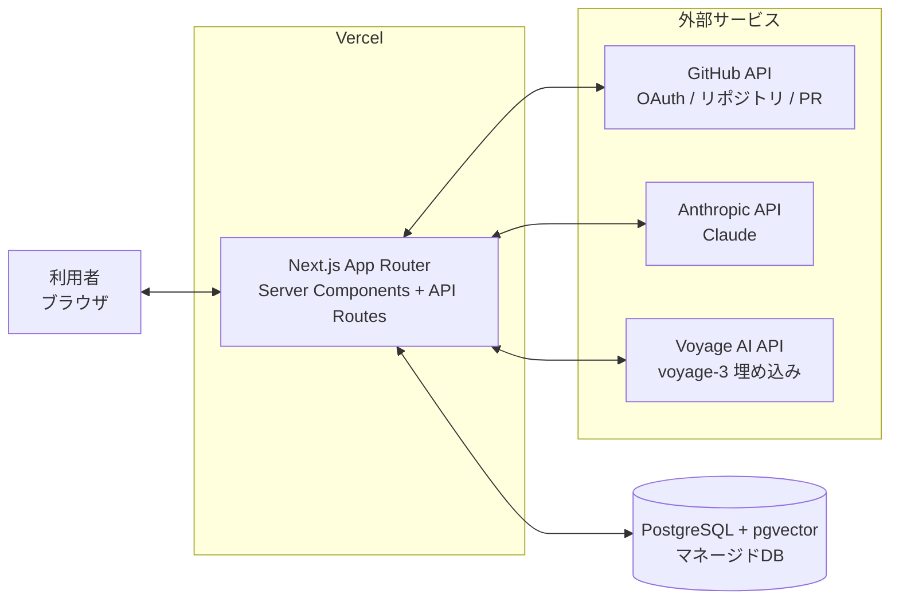
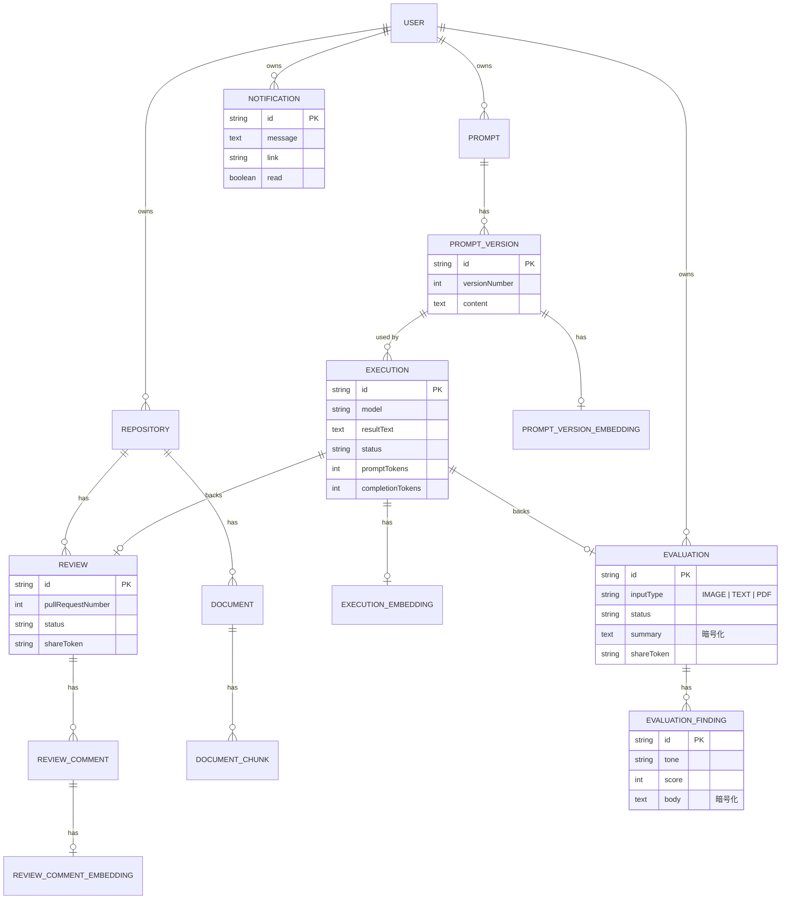

# 基本設計書

| 項目 | 内容 |
| --- | --- |
| 文書名 | ai-forge 基本設計書 |
| 対象システム | ai-forge(統合AI開発支援プラットフォーム) |
| 版数 | 1.0.0 |
| 対応バージョン | v1.1.0 |
| 作成日 | 2026-08-27 |

要件は[`requirements-definition.md`](./requirements-definition.md)を参照。本書は各Phaseの詳細設計([`phase1-design.md`](./phases/phase1-design.md)〜[`phase5-design.md`](./phases/phase5-design.md)、[`db-design.md`](./db-design.md))を横断的に俯瞰できるようまとめたものであり、個々の設計判断の理由(なぜその方式を選んだか)は各詳細設計書に譲る。

## 1. システム構成

### 1.1 全体構成図



### 1.2 技術スタック

| 区分 | 技術 |
| --- | --- |
| フロントエンド/バックエンド | Next.js(App Router)、TypeScript |
| スタイリング | Tailwind CSS |
| DB | PostgreSQL + pgvector拡張(ベクトル検索を同一DBに統合) |
| ORM | Prisma(`@prisma/adapter-pg`によるドライバアダプタ構成) |
| 認証 | NextAuth.js(GitHub OAuth) |
| AI | Anthropic API(Claude Opus 5 / Sonnet 5 / Haiku 4.5) |
| 埋め込み | Voyage AI(`voyage-3`、1024次元) |
| GitHub連携 | Octokit(GitHub公式SDK) |
| デプロイ | Vercel(本番、東京リージョン) |
| CI | GitHub Actions(lint・単体テスト・結合テスト・ビルド) |
| テスト | Vitest(単体・結合) |

### 1.3 アプリケーション構成

- `src/app/(app)/` — 認証必須の画面群。ルートグループの`layout.tsx`で`requireUserId()`によるガードを一元化する。
- `src/app/share/` — ログイン不要の読み取り専用公開画面(共有リンク)。
- `src/app/api/` — API Routes(REST風)。
- `src/lib/` — ドメインロジック・外部API呼び出し・共通ユーティリティ。
- `src/components/` — 再利用可能なUIコンポーネント。
- `prisma/` — スキーマ定義・マイグレーション。

## 2. 画面一覧

| パス | 画面名 | 認証 | 概要 |
| --- | --- | --- | --- |
| `/login` | ログイン | 不要 | GitHub OAuthログイン |
| `/dashboard` | ダッシュボード | 必須 | 横断サマリ、各機能への導線 |
| `/prompts` | プロンプト一覧 | 必須 | プロンプト一覧・検索・カテゴリ管理への導線 |
| `/prompts/new` | プロンプト新規作成 | 必須 | テンプレートからの作成、手動作成 |
| `/prompts/:id` | プロンプト詳細 | 必須 | 編集・実行・実行履歴・バージョン履歴タブ |
| `/prompts/:id/compare` | 実行結果比較 | 必須 | 2件の実行結果を左右比較 |
| `/categories` | カテゴリ管理 | 必須 | カテゴリCRUD |
| `/repositories` | リポジトリ一覧 | 必須 | 接続済みGitHubリポジトリ一覧・接続 |
| `/repositories/:id` | リポジトリ詳細 | 必須 | オープンなPR・レビュー履歴・傾向タブ |
| `/repositories/:id/compare` | レビュー結果比較 | 必須 | 2件のレビュー結果を左右比較 |
| `/reviews/:id` | レビュー詳細 | 必須 | レビュー結果・共有リンク |
| `/documents` | ドキュメント管理 | 必須 | 登録・同期・バックフィル |
| `/chat` | RAG検索チャット | 必須 | 自然文検索・チャットからのレビュー実行 |
| `/evaluations` | AI評価一覧 | 必須 | 評価の新規作成(画像/テキスト/PDF)・履歴一覧 |
| `/evaluations/:id` | AI評価詳細 | 必須 | 評価結果・共有リンク |
| `/usage` | 利用状況ダッシュボード | 必須 | トークン使用量・埋め込み件数 |
| `/errors` | エラーログ | 必須 | 想定外エラーの一覧 |
| `/help` | ヘルプ | 必須 | アプリ内マニュアル |
| `/share/reviews/:token` | レビュー結果(公開) | 不要 | 共有リンク経由の読み取り専用表示 |
| `/share/evaluations/:token` | 評価結果(公開) | 不要 | 共有リンク経由の読み取り専用表示 |

### 2.1 画面遷移図(主要導線)

```mermaid
flowchart TD
    Login[/login] --> Dashboard[/dashboard]
    Dashboard --> Prompts[/prompts]
    Dashboard --> Repositories[/repositories]
    Dashboard --> Documents[/documents]
    Dashboard --> Chat[/chat]
    Dashboard --> Evaluations[/evaluations]
    Dashboard --> Usage[/usage]

    Prompts --> PromptNew[/prompts/new]
    Prompts --> PromptDetail[/prompts/:id]
    PromptDetail --> PromptCompare[/prompts/:id/compare]
    Prompts --> Categories[/categories]

    Repositories --> RepoDetail[/repositories/:id]
    RepoDetail --> RepoCompare[/repositories/:id/compare]
    RepoDetail --> ReviewDetail[/reviews/:id]
    ReviewDetail -- 共有リンク --> SharedReview[/share/reviews/:token]

    Evaluations --> EvalDetail[/evaluations/:id]
    EvalDetail -- 共有リンク --> SharedEval[/share/evaluations/:token]

    Chat -- 意図検出+確認 --> RepoDetail
```

## 3. 機能設計概要

機能要件(FR-101〜FR-606、[`requirements-definition.md`](./requirements-definition.md)参照)は、共通の実行基盤の上に構築される。

### 3.1 共通実行基盤

プロンプト実行・AIレビュー・AI評価は、いずれも`src/lib/run-ai-execution.ts`の`runAiExecution()`を経由してClaude APIを呼び出し、成功/失敗を`Execution`テーブルに記録する。呼び出し元は「Claude呼び出しそのもの」だけを`call`関数として渡し、`Execution`の作成(成功・失敗いずれの場合も)は共通処理に任せる。

- プロンプト実行: `POST /api/prompts/:id/execute` が直接この基盤を呼ぶ
- AIレビュー: `POST /api/repositories/:id/reviews` が`{{diff}}`展開後にこの基盤を呼ぶ
- AI評価: `POST /api/evaluations` がこの基盤を呼ぶ(バックグラウンド実行、詳細は3.3節)

### 3.2 構造化出力

AIレビュー・AI評価はいずれもZodスキーマ(`review-schema.ts`・`evaluation-schema.ts`)を`output_config.format`に指定し、Claudeの構造化出力機能で`{ findings: [...] }`形式のJSONを強制取得する。自由記述テキストのパースを避け、`ReviewComment`・`EvaluationFinding`へ直接マッピングする。

### 3.3 バックグラウンド処理

画像・PDF評価はレイテンシが大きいため、`POST /api/evaluations`はバリデーション・レート制限チェック後に`PENDING`な`Evaluation`を作成して`202 Accepted`を即座に返し、実際のAI呼び出しはNext.jsの`after()`でレスポンス送出後に継続する(`src/lib/schedule-background.ts`)。新規の常駐ワーカー・キューサービスは追加していない。完了は次の2経路で利用者に伝わる。

1. `(app)/layout.tsx`に常駐する`PendingEvaluationsProvider`が生成直後のEvaluationをポーリングし、トースト通知する。
2. サーバー側で`Notification`レコードを作成し、ヘッダー常駐の通知センターがポーリングして未読バッジ表示する(トーストを見逃した場合の保険、詳細は[`phase5-design.md`](./phases/phase5-design.md)「通知センター」参照)。

### 3.4 RAG検索

`src/lib/embeddings.ts`が埋め込みの読み書き(pgvectorの`Unsupported`型に対する`$queryRaw`/`$executeRaw`)を担当する。検索対象は`Document`(チャンク単位)・`ReviewComment`・`PromptVersion`・`Execution`(レビュー・AI評価由来を除く)の4種で、質問文を埋め込みコサイン距離検索し、上位を`ChatSource`として出典付きでClaudeに渡す。

### 3.5 共有リンク

`Review`・`Evaluation`に`shareToken`(`crypto.randomBytes`発行の専用トークン)・`sharedAt`を持たせ、`POST/DELETE /api/{reviews,evaluations}/:id/share`で発行・解除する。公開ページ(`/share/...`)は`(app)`ルートグループの外に置き、認証を要求せず`shareToken`一致のみで対象を取得する(所有者チェックはしない。トークン自体が公開用の鍵)。詳細は[`phase5-design.md`](./phases/phase5-design.md)「共有リンク」を参照。

## 4. DB設計

テーブル定義・設計判断の詳細は[`db-design.md`](./db-design.md)を参照。ここでは主要ドメインのER図のみ示す。



全21テーブル(認証系4・プロンプト管理系6・AIレビュー系3・RAG系5・AI評価系3)の一覧は[`db-design.md`](./db-design.md)「テーブル一覧」を参照。

## 5. API設計

REST風のAPI Routes。認証は`auth()`(NextAuth.js)によるセッション確認、認可は対象リソースの`userId`一致確認で行い、不一致・未認証はいずれも404または401を返す(存在の有無を推測させないため、所有者以外には一律404)。

| メソッド・パス | 概要 |
| --- | --- |
| `GET/POST /api/categories`、`PATCH/DELETE /api/categories/:id` | カテゴリCRUD |
| `GET/POST /api/prompts`、`GET/PATCH/DELETE /api/prompts/:id` | プロンプトCRUD |
| `GET /api/prompts/:id/versions` | バージョン履歴取得 |
| `POST /api/prompts/:id/execute`、`GET /api/prompts/:id/executions` | プロンプト実行・実行履歴取得 |
| `POST /api/prompts/:id/improvement-suggestions` | レビュー指摘蓄積からのプロンプト改善提案 |
| `POST /api/prompt-versions/backfill-embeddings` | プロンプトバージョン埋め込みの一括バックフィル |
| `GET/POST /api/repositories`、`GET/DELETE /api/repositories/:id` | リポジトリ接続・解除 |
| `GET /api/repositories/:id/pulls` | オープンなPR一覧取得 |
| `GET/POST /api/repositories/:id/reviews` | レビュー実行・履歴取得 |
| `POST /api/repositories/:id/documents/sync` | 接続リポジトリの設計書同期 |
| `GET /api/reviews/:id` | レビュー詳細取得 |
| `POST/DELETE /api/reviews/:id/share` | レビュー共有リンクの発行・解除 |
| `POST /api/review-comments/backfill-embeddings` | レビュー指摘埋め込みの一括バックフィル |
| `GET/POST /api/documents`、`DELETE /api/documents/:id` | ドキュメントCRUD |
| `POST /api/documents/sync` | ai-forge自身の設計書同期 |
| `POST /api/executions/backfill-embeddings` | 実行結果埋め込みの一括バックフィル |
| `POST /api/chat` | RAG検索チャットの質問応答 |
| `GET/POST /api/evaluations`、`GET/DELETE /api/evaluations/:id` | AI評価CRUD(作成はバックグラウンド実行) |
| `POST/DELETE /api/evaluations/:id/share` | 評価共有リンクの発行・解除 |
| `GET /api/notifications`、`PATCH /api/notifications/:id`、`POST /api/notifications/read-all` | 通知の一覧取得・既読化 |
| `GET /api/github/repos` | 接続可能なGitHubリポジトリ一覧取得 |
| `GET /api/search` | 横断検索(コマンドパレット) |
| `POST /api/client-errors` | クライアント側エラーの報告 |
| `GET/POST /api/auth/[...nextauth]` | NextAuth.js認証エンドポイント |

## 6. 外部インターフェース設計

| 連携先 | 用途 | 備考 |
| --- | --- | --- |
| GitHub OAuth / REST API | ログイン、リポジトリ接続、PR・diff取得 | アクセストークンは暗号化保存、`refresh_token`による自動更新に対応 |
| Anthropic API(Claude) | プロンプト実行・AIレビュー・AI評価・チャット回答生成・チャットのtool use解析 | モデルはOpus 5/Sonnet 5/Haiku 4.5から選択可能。用途により既定モデルを使い分け(例: チャットのtool use解析は低コストなHaiku 4.5) |
| Voyage AI API | 埋め込み生成(`voyage-3`) | RAG検索対象すべての埋め込み生成に使用。GitHubトークンとは別の`VOYAGE_API_KEY`で認証 |

## 7. セキュリティ設計

- **認証**: GitHub OAuth(NextAuth.js)。セッション確認は`React.cache`でリクエスト単位にメモ化。
- **認可**: 全リソースは`userId`で所有者を判定し、他ユーザーのリソースには404を返す。
- **トークン暗号化**: GitHubアクセストークン・リフレッシュトークン、AI評価結果本文をAES-256-GCMで暗号化して保存(`src/lib/token-crypto.ts`、`src/lib/field-crypto.ts`)。鍵は環境変数`TOKEN_ENCRYPTION_KEY`。暗号化導入前の平文データは読み取り時に検知し、書き戻しで自然移行させる。
- **レート制限**: 実行系API・クライアントエラー報告は、ユーザー×用途の1時間あたり上限をアトミックなカウンタ(`RateLimitBucket`、`upsert`による`ON CONFLICT DO UPDATE`)で制御し、TOCTOUレースを排除する。
- **共有リンク**: リソースIDとは独立した専用トークンを発行。作成前に非公開情報の確認を促す。
- **入力制約**: リポジトリファイル同期は固定の対象パスのみを扱い、任意パス指定を許可しない。

## 8. エラーハンドリング方針

- サーバー側の想定外エラーはNext.jsの`instrumentation.ts`(`onRequestError`)で捕捉し、`ErrorLog`に記録する。
- クライアント側のエラーは`error.tsx`/`global-error.tsx`から`POST /api/client-errors`経由で記録する。
- 外部API(GitHub・Anthropic・Voyage AI)呼び出しの失敗は握りつぶさず、`logError()`でErrorLogに記録したうえで、可能な限り主処理(レビュー・評価そのもの)は継続させる(埋め込み生成失敗等の副次処理はベストエフォートとし、主処理を失敗させない)。
- `/errors`画面では、自分のユーザーIDに紐づくログと、ユーザー非紐付け(システム全体)のログのみを表示し、他ユーザーの個人情報を含みうるログは見せない。

## 9. 画面設計・詳細設計への参照

各画面のワイヤーフレーム・詳細な処理フローは、Phase単位の詳細設計書を参照。

| Phase | 詳細設計書 |
| --- | --- |
| Phase 1 | [`phase1-design.md`](./phases/phase1-design.md)、[`phase1-ui-design.md`](./phases/phase1-ui-design.md) |
| Phase 2 | [`phase2-design.md`](./phases/phase2-design.md) |
| Phase 3 | [`phase3-design.md`](./phases/phase3-design.md) |
| Phase 4 | [`phase4-design.md`](./phases/phase4-design.md) |
| Phase 5 | [`phase5-design.md`](./phases/phase5-design.md) |
| 品質・運用対応全般 | [`quality-improvements.md`](./quality-improvements.md) |
| 自動テストの仕様 | [`test-specification.md`](./test-specification.md)(詳細は[`tests/unit-tests.md`](./tests/unit-tests.md)・[`tests/integration-tests.md`](./tests/integration-tests.md)) |
| 手動テストチェックリスト | [`manual-test-checklist.md`](./manual-test-checklist.md) |
