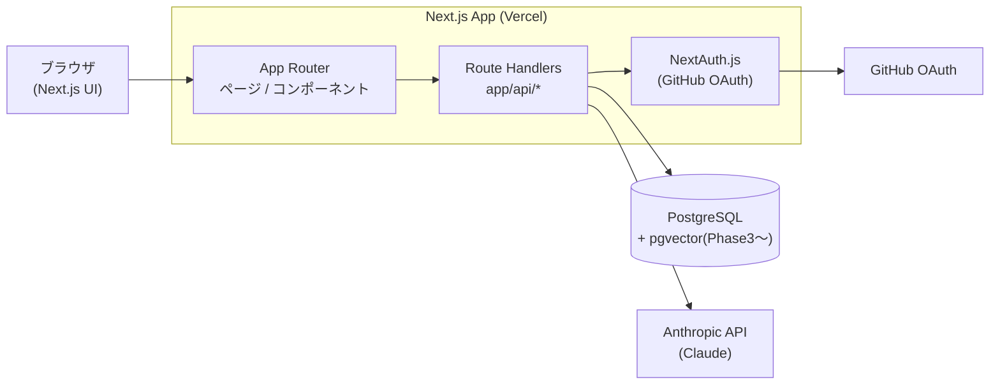
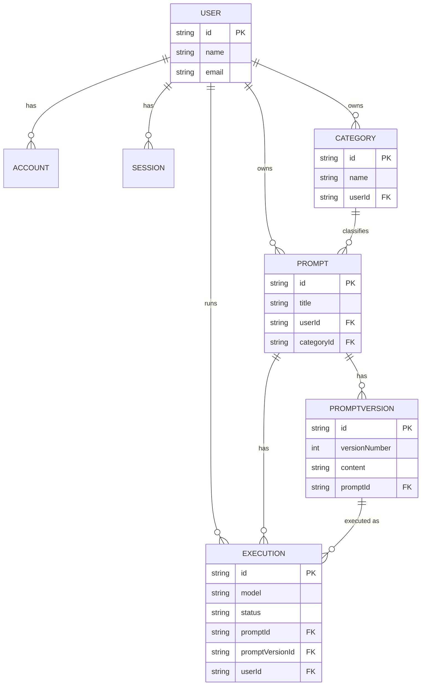

# Phase 1 基本設計書

対象: プロンプト管理ツール(統合AI開発支援プラットフォームの土台)
更新日: 2026-08-23 / ステータス: DB設計完了、UI設計は次タスクで詳細化

プロダクト全体のコンセプトとロードマップは [`ai-dev-tool-handoff.md`](../ai-dev-tool-handoff.md)、DB設計の詳細な判断理由は [`docs/db-design.md`](./db-design.md) を参照。本ドキュメントはPhase 1のアーキテクチャ・認証・DB・画面・APIを一つにまとめた全体像。

## 概要

AIに投げるプロンプトを「コードのように」管理・改善するためのツール。Phase 1では以下を実現する。

- プロンプトのCRUD(登録・編集・削除・カテゴリ分け)
- 登録したプロンプトをAnthropic API(Claude)に投げて実行し、結果を表示する
- 実行履歴とプロンプトの変更履歴(バージョン)を保存する

Phase 2(AIコードレビュー)・Phase 3(RAG検索チャットボット)は、Phase 1で構築するAI呼び出しの仕組みと認証基盤をそのまま再利用する前提で設計している。

## システム構成

## 技術スタック

| 領域 | 技術 | 役割 |
| --- | --- | --- |
| フロントエンド | Next.js(App Router)+ TypeScript + Tailwind CSS | UI構築 |
| バックエンド | Next.js Route Handlers(`app/api/*`) | API提供。必要に応じて別サービスへ分離可能な構成 |
| DB | PostgreSQL + Prisma | プロンプト・実行履歴・ユーザーの永続化 |
| ベクトル検索 | pgvector拡張(Phase 3で有効化) | 同一PostgreSQL内でRAG用ベクトル検索を行う |
| AI | Anthropic API(Claude) | プロンプト実行・コードレビュー・RAG応答 |
| 認証 | NextAuth.js(GitHub OAuth)+ Prisma Adapter | ログイン、Phase 2のGitHub連携で同じ認証基盤を再利用 |
| デプロイ | Vercel | ホスティング |

## 認証設計

NextAuth.jsの Prisma Adapter を使い、`User` / `Account` / `Session` / `VerificationToken` をDBセッション方式で管理する(スキーマは`prisma/schema.prisma`)。GitHub OAuthのみを一次プロバイダとする。

1. ユーザーが「GitHubでログイン」を選択
2. GitHubの認可画面でOAuth許可
3. NextAuthがコールバックを受け取り、`Account`(プロバイダ情報)と`Session`をDBに作成/更新
4. 以降のリクエストはセッションクッキーで認証し、Route Handlers側で`userId`を元にプロンプト・カテゴリ・実行履歴をユーザー単位にスコープする

Phase 2でGitHubリポジトリのPR/差分を取得する際も、同じGitHub Accountのアクセストークンを再利用する想定。

## DB設計サマリ

詳細な設計判断(なぜPromptに本文を持たせずPromptVersionに持たせたか等)は [`docs/db-design.md`](./db-design.md) を参照。ここでは全体のER関係のみ示す。

## 画面構成(暫定)

詳細な画面遷移・UI設計は次タスクで行う。現時点で想定している画面は以下。

| 画面 | 概要 |
| --- | --- |
| ログイン | GitHub OAuthでのサインイン |
| プロンプト一覧 | カテゴリ別・検索でのプロンプト一覧表示 |
| プロンプト詳細/編集 | 本文編集(新しいバージョンとして保存)、バージョン履歴の閲覧 |
| プロンプト実行 | Claudeへの実行、結果表示、実行履歴の記録 |
| カテゴリ管理 | カテゴリの作成・編集・削除 |
| 実行履歴 | 過去の実行結果とその時点のプロンプト内容の確認 |

## API設計方針

Next.js の Route Handlers(`app/api/*`)としてREST風に実装する。Server Actionsではなく明示的なAPIエンドポイントとする理由は、Phase 2・3でも同じAI実行の仕組みを外部から呼び出せる形にしておくため。

| メソッド / パス | 概要 |
| --- | --- |
| `POST /api/auth/[...nextauth]` | NextAuth.js標準ハンドラ(GitHub OAuth) |
| `GET/POST /api/categories` | カテゴリ一覧取得・作成 |
| `PATCH/DELETE /api/categories/:id` | カテゴリ更新・削除 |
| `GET/POST /api/prompts` | プロンプト一覧取得・新規作成 |
| `GET/PATCH/DELETE /api/prompts/:id` | プロンプト取得・更新・削除 |
| `GET /api/prompts/:id/versions` | バージョン履歴取得 |
| `POST /api/prompts/:id/execute` | 最新(または指定)バージョンでAI実行し、`Execution`を記録 |
| `GET /api/prompts/:id/executions` | 実行履歴取得 |

## 今後のステップ

1. 画面遷移・UI設計(詳細なワイヤーフレーム・画面遷移図)
2. ローカルDB環境構築(Docker + PostgreSQL + pgvector拡張)、`prisma migrate dev`の実行
3. NextAuth.js + GitHub OAuthの実装
4. プロンプトCRUD・実行機能の実装(Phase 1完了)
