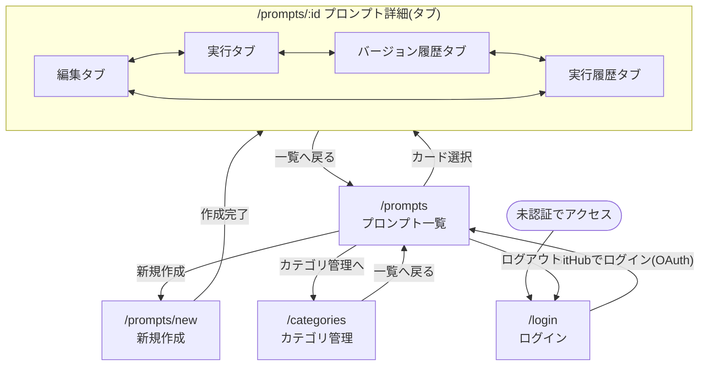

# Phase 1 画面遷移・UI設計

対象: プロンプト管理ツール(Phase 1)。全体像は [`phase1-design.md`](./phase1-design.md) の「画面構成(暫定)」「API設計方針」を詳細化したもの。

## ルーティング一覧

| パス | 画面 | 認証 |
| --- | --- | --- |
| `/login` | ログイン | 不要(未認証時のトップ) |
| `/prompts` | プロンプト一覧 | 必要 |
| `/prompts/new` | プロンプト新規作成 | 必要 |
| `/prompts/[id]` | プロンプト詳細(タブ切替: 編集/実行/バージョン履歴/実行履歴) | 必要 |
| `/categories` | カテゴリ管理 | 必要 |

`/prompts/[id]` はサブページに分割せずタブ構成にする。理由: 4画面すべてが同じ`promptId`をコンテキストに持ち、タブ切替のたびに一覧から再度たどり直す手間をなくすため(API設計(`/api/prompts/:id/*`)ともパスの構造が一致する)。

## 画面遷移図



## 画面ごとの詳細

### 1. ログイン(`/login`)

```
┌──────────────────────────────────────┐
│               ai-forge                │
│        プロンプトをコードのように       │
│                                        │
│         [ GitHubでログイン ]           │
│                                        │
└──────────────────────────────────────┘
```

- 未認証状態で保護ページにアクセスした場合はこの画面にリダイレクト
- ボタン押下でNextAuthのGitHub OAuthフローを開始し、成功後は`/prompts`へ遷移

### 2. プロンプト一覧(`/prompts`)

```
┌──────────────────────────────────────────────────────┐
│ ai-forge      [プロンプト] [カテゴリ管理]      [ユーザー▾]│
├──────────────────────────────────────────────────────┤
│ [カテゴリ: すべて ▾]   [検索_______________]  [+ 新規作成]│
├──────────────────────────────────────────────────────┤
│ ┌────────────────┐ ┌────────────────┐ ┌───────────┐ │
│ │ タイトル          │ │ タイトル          │ │ タイトル    │ │
│ │ カテゴリ: 要約     │ │ カテゴリ: 未分類   │ │ カテゴリ:…  │ │
│ │ 更新: 2026-08-20  │ │ 更新: 2026-08-18  │ │ 更新:…     │ │
│ └────────────────┘ └────────────────┘ └───────────┘ │
│  ...カード形式で一覧表示、クリックで詳細へ...           │
└──────────────────────────────────────────────────────┘
```

- ログイン後のトップページ
- カテゴリ絞り込み(ドロップダウン)・タイトル検索(クライアントサイドまたは`GET /api/prompts?category=&q=`)
- カードは`title` / `category.name` / 最新`PromptVersion.updatedAt`相当(`Prompt.updatedAt`)を表示
- 「+ 新規作成」→`/prompts/new`

### 3. プロンプト新規作成(`/prompts/new`)

```
┌──────────────────────────────────────┐
│ ← 一覧へ戻る                           │
│                                        │
│ タイトル [______________________]      │
│ カテゴリ [未分類 ▾]                     │
│ 本文                                   │
│ ┌────────────────────────────────┐   │
│ │                                  │   │
│ │  (テキストエリア)                  │   │
│ │                                  │   │
│ └────────────────────────────────┘   │
│                          [ 作成 ]      │
└──────────────────────────────────────┘
```

- 送信時に`POST /api/prompts`(タイトル・カテゴリ)→続けて`PromptVersion`(`versionNumber: 1`)を作成
- 作成後は`/prompts/[id]`(編集タブ)へ遷移

### 4. プロンプト詳細 — 編集タブ

```
┌──────────────────────────────────────────────────────┐
│ ← 一覧へ戻る    タイトル [________________]  カテゴリ[▾]│
│ [編集] [実行] [バージョン履歴] [実行履歴]                 │
├──────────────────────────────────────────────────────┤
│ 現在のバージョン: v3 (2026-08-20更新)                   │
│ ┌────────────────────────────────────────────────┐  │
│ │ (本文テキストエリア。最新PromptVersion.contentを表示) │  │
│ └────────────────────────────────────────────────┘  │
│ 更新メモ(任意) [___________________________]          │
│                                    [ 新しいバージョンとして保存 ] │
│                                    [ 削除 ]              │
└──────────────────────────────────────────────────────┘
```

- 保存ボタンは常に新規`PromptVersion`を追加(上書きしない)。`versionNumber`はアプリ側でmax+1
- 「削除」は`Prompt`ごと削除(確認ダイアログを挟む)。`DELETE /api/prompts/:id`

### 5. プロンプト詳細 — 実行タブ

```
┌──────────────────────────────────────────────────────┐
│ [編集] [実行] [バージョン履歴] [実行履歴]                 │
├──────────────────────────────────────────────────────┤
│ 実行対象バージョン: [v3(最新) ▾]                        │
│ モデル: [claude-... ▾]                                 │
│ 変数(プロンプト内の{{変数}}を検出して自動生成)             │
│   変数名1 [_______________]                            │
│   変数名2 [_______________]                            │
│                                          [ 実行 ]        │
├──────────────────────────────────────────────────────┤
│ 実行結果                                                │
│ ┌────────────────────────────────────────────────┐  │
│ │ (resultText、または FAILED時はerrorMessage)         │  │
│ └────────────────────────────────────────────────┘  │
│ status: SUCCESS / tokens: 120+340 / 1.2s               │
└──────────────────────────────────────────────────────┘
```

- 実行対象バージョンを選べる(デフォルトは最新)。`POST /api/prompts/:id/execute`に`promptVersionId`・`variables`・`model`を送信
- 実行結果はこの場に表示すると同時に、`Execution`として保存 → 実行履歴タブに反映される
- 失敗時(`status: FAILED`)は`resultText`なしで`errorMessage`を表示

### 6. プロンプト詳細 — バージョン履歴タブ

```
┌──────────────────────────────────────────────────────┐
│ [編集] [実行] [バージョン履歴] [実行履歴]                 │
├──────────────────────────────────────────────────────┤
│ v3  2026-08-20  "変数対応を追加"        [表示] [このバージョンで実行]│
│ v2  2026-08-18  (メモなし)             [表示] [このバージョンで実行]│
│ v1  2026-08-15  "初版"                 [表示] [このバージョンで実行]│
└──────────────────────────────────────────────────────┘
```

- `GET /api/prompts/:id/versions`。新しい順に一覧表示
- 「表示」は読み取り専用モーダルで`content`を表示(このタブでは編集不可。編集は常に最新版に対して行う設計のため)
- 「このバージョンで実行」→実行タブに遷移し、対象バージョンをそのIDで選択済みにする

### 7. プロンプト詳細 — 実行履歴タブ

```
┌──────────────────────────────────────────────────────┐
│ [編集] [実行] [バージョン履歴] [実行履歴]                 │
├──────────────────────────────────────────────────────┤
│ 2026-08-20 14:03  v3  SUCCESS  claude-...  [詳細]        │
│ 2026-08-19 10:11  v2  FAILED   claude-...  [詳細]        │
│ 2026-08-18 09:40  v3  SUCCESS  claude-...  [詳細]        │
└──────────────────────────────────────────────────────┘
```

- `GET /api/prompts/:id/executions`。新しい順
- 「詳細」で`resultText`(または`errorMessage`)・`variables`・トークン数・実行時間をモーダル表示
- 各行がどの`PromptVersion`(バージョン番号)で実行されたかを明示し、当時のプロンプト内容にも遡れるようにする(バージョン履歴タブとの連携)

### 8. カテゴリ管理(`/categories`)

```
┌──────────────────────────────────────────────────────┐
│ ← 一覧へ戻る                                            │
│ 新規カテゴリ名 [______________] 説明[____________] [追加]│
├──────────────────────────────────────────────────────┤
│ 要約          (3件)   [編集] [削除]                     │
│ コードレビュー   (5件)   [編集] [削除]                     │
│ 未分類は表示しない(暗黙のカテゴリのため作成・削除不可)      │
└──────────────────────────────────────────────────────┘
```

- `GET/POST /api/categories`、`PATCH/DELETE /api/categories/:id`
- カテゴリ削除時、そのカテゴリに属する`Prompt.categoryId`は`null`(未分類)になる(スキーマの`onDelete: SetNull`)。削除確認ダイアログに「この操作でN件のプロンプトが未分類になります」と表示する

## 共通コンポーネント

| コンポーネント | 用途 | 使用画面 |
| --- | --- | --- |
| `PromptCard` | 一覧のカード表示 | プロンプト一覧 |
| `PromptTabs` | 編集/実行/バージョン履歴/実行履歴のタブ切替 | プロンプト詳細 |
| `VersionList` | バージョン一覧の行表示(共通化し、バージョン履歴タブと実行タブのセレクタで再利用) | バージョン履歴、実行 |
| `ExecutionResultPanel` | 実行結果・エラー表示 | 実行、実行履歴(詳細モーダル) |
| `CategorySelect` | カテゴリ選択ドロップダウン(未分類を含む) | 一覧の絞り込み、編集タブ、新規作成 |

## 次のステップ

この画面設計をもとに、[`phase1-design.md`](./phase1-design.md) の「今後のステップ」3〜4(NextAuth.js実装、CRUD・実行機能の実装)に進む。
