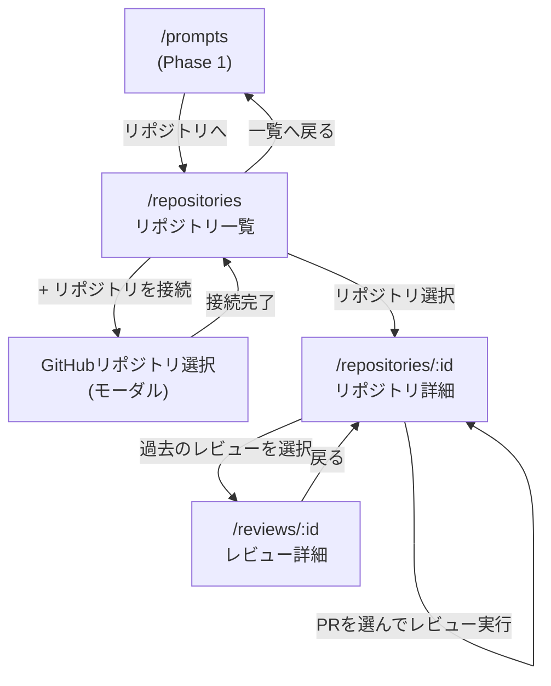

# Phase 2 基本設計書(画面遷移・UI設計)

対象: AIコードレビューツール(Phase 2)。アーキテクチャ・認証は [`phase1-design.md`](./phase1-design.md) を、DB設計は [`db-design.md`](./db-design.md) の「Phase 2の設計判断」を参照。本ドキュメントはPhase 2で新規に追加する画面・APIをまとめる。

## 概要

接続したGitHubリポジトリのオープンなPRに対し、Phase 1で管理しているプロンプト資産を使ってAIレビューを実行し、指摘事項を蓄積するツール。

- GitHub連携(接続したリポジトリのオープンなPRを一覧表示)
- AIレビュー機能(選んだプロンプト×選んだPRの差分をClaudeに解析させる)
- レビュー結果の蓄積(指摘をDBに保存し、重要度別に一覧・集計する)

GitHub OAuthのアクセストークンはPhase 1のログインで取得済みの`Account.access_token`を再利用する。ただし現在のスコープ(デフォルト)ではプライベートリポジトリの差分取得ができないため、`repo`スコープの追加同意が必要になる想定(GitHub連携実装時に対応)。

## 画面構成

| パス | 画面 |
| --- | --- |
| `/repositories` | 接続済みリポジトリ一覧・GitHubリポジトリの接続 |
| `/repositories/:id` | リポジトリ詳細(オープンなPR一覧・レビュー実行・レビュー履歴) |
| `/reviews/:id` | レビュー詳細(指摘事項の一覧) |

Phase 1の`/prompts`ヘッダーに「リポジトリ」リンクを追加し、`/repositories`への導線とする。

## 画面遷移図



## 画面ごとの詳細

### 1. リポジトリ一覧(`/repositories`)

```
┌──────────────────────────────────────────────────────┐
│ ← プロンプト一覧へ                                       │
│ 接続済みリポジトリ                    [+ リポジトリを接続]  │
├──────────────────────────────────────────────────────┤
│ owner/repo-a         最終レビュー: 2026-08-20  [開く][解除]│
│ owner/repo-b         レビューなし              [開く][解除]│
└──────────────────────────────────────────────────────┘
```

- 「+ リポジトリを接続」→GitHub APIから取得した自分のリポジトリ一覧をモーダルで表示し、選んだものを`POST /api/repositories`で接続する
- 「解除」は`DELETE /api/repositories/:id`。接続解除すると、そのリポジトリに紐づく`Review`・`ReviewComment`もカスケード削除される(db-design.md参照)ため、確認ダイアログに件数を表示する

### 2. リポジトリ詳細(`/repositories/:id`)

```
┌──────────────────────────────────────────────────────┐
│ ← リポジトリ一覧へ    owner/repo-a                        │
│ [オープンなPR] [レビュー履歴] [傾向]                        │
├──────────────────────────────────────────────────────┤
│ #42 Add feature X                     [レビューを実行]    │
│   使用するプロンプト: [コードレビュー v3 ▾]                 │
│ #41 Fix bug Y                         [レビューを実行]    │
└──────────────────────────────────────────────────────┘
```

- 「オープンなPR」タブ: `GET /api/repositories/:id/pulls`でGitHub APIをその場で呼び出し表示する(DBには保存しない)。使用するプロンプトはユーザーの`Prompt`一覧から選択(バージョンは常に最新を使用)
- 「レビュー履歴」タブ: 過去の`Review`を新しい順に一覧し、各行に指摘件数を表示する
- 「傾向」タブ: そのリポジトリでの累計指摘件数(重要度別)、直近10件のレビューの重要度内訳(積み上げバー)、指摘の多いファイルTOP8を表示する。すべて`ReviewComment`に対する`groupBy`集計で、`/repositories/:id`のServer Componentが直接Prismaへ問い合わせる(専用APIは設けていない)。これがPhase 2スコープでの「傾向の可視化」にあたる(リポジトリ横断のダッシュボードはPhase 3で扱う)

### 3. レビュー詳細(`/reviews/:id`)

```
┌──────────────────────────────────────────────────────┐
│ ← リポジトリへ戻る    #42 Add feature X                   │
│ status: SUCCESS   実行: 2026-08-23 18:10   claude-opus-5 │
│ CRITICAL 0   WARNING 2   INFO 3                          │
├──────────────────────────────────────────────────────┤
│ src/foo.ts:10  [WARNING]                                 │
│   未使用の変数があります                                  │
│ src/bar.ts:—   [INFO]                                    │
│   ...                                                     │
└──────────────────────────────────────────────────────┘
```

- `GET /api/reviews/:id`。`Review`本体(PR情報・status・使用モデル・トークン数など`Execution`経由の情報)と`ReviewComment`一覧(ファイルパス順)を表示
- `status: FAILED`の場合は指摘一覧の代わりにエラーメッセージを表示(Phase 1のExecution失敗表示と同じ考え方)

## API設計

| メソッド / パス | 概要 |
| --- | --- |
| `GET/POST /api/repositories` | 接続済みリポジトリ一覧取得・新規接続 |
| `DELETE /api/repositories/:id` | 接続解除(Review・ReviewCommentもカスケード削除) |
| `GET /api/repositories/:id/pulls` | GitHub APIをプロキシしてオープンなPR一覧を取得(非保存) |
| `GET /api/repositories/:id/reviews` | リポジトリのレビュー履歴取得 |
| `POST /api/repositories/:id/reviews` | 指定PR・プロンプトでAIレビューを実行し、Review・Execution・ReviewCommentを作成 |
| `GET /api/reviews/:id` | レビュー詳細(指摘一覧を含む) |

## レビュー実行の設計方針

`POST /api/repositories/:id/reviews`は次の流れで処理する。

1. GitHub APIで指定PRのdiff(unified diff形式)を取得する
2. 選択された`PromptVersion`の本文にdiffを変数(`{{diff}}`)として展開する(Phase 1の変数置換ロジック`src/lib/prompt-variables.ts`を再利用)
3. Claudeの[構造化出力](https://docs.anthropic.com)(`output_config.format`)で、指摘事項を`{ findings: [{ filePath, line, severity, body }] }`形式のJSONとして返すよう指定する。自由記述のテキストをパースするのではなく、スキーマで型を保証する
4. `Execution`(AI呼び出しの記録)と`Review`(PRの文脈)を作成し、`findings`をそのまま`ReviewComment`として保存する

構造化出力のスキーマは`src/lib/review-schema.ts`でZodにより定義し、`@anthropic-ai/sdk/helpers/zod`の`zodOutputFormat`経由で`client.messages.parse`に渡している(`parsed_output`が型安全に得られる)。

## 実装状況

1. ~~GitHub連携の実装~~ → 完了。`repo`スコープの追加、`octokit`によるリポジトリ接続・PR取得API、`/repositories`・`/repositories/:id`画面
2. ~~AIレビュー機能の実装~~ → 完了。`POST /api/repositories/:id/reviews`でPRのdiffを`{{diff}}`変数に展開し、構造化出力でレビュー結果を取得。`/repositories/:id`の「レビューを実行」・`/reviews/:id`画面
3. ~~レビュー結果の蓄積・可視化~~ → 完了(リポジトリ単位)。`/repositories/:id`に「傾向」タブを追加し、累計指摘件数(重要度別)・直近10件のレビューの重要度内訳・指摘の多いファイルTOP8を表示。リポジトリ横断のダッシュボードはPhase 3で扱う
