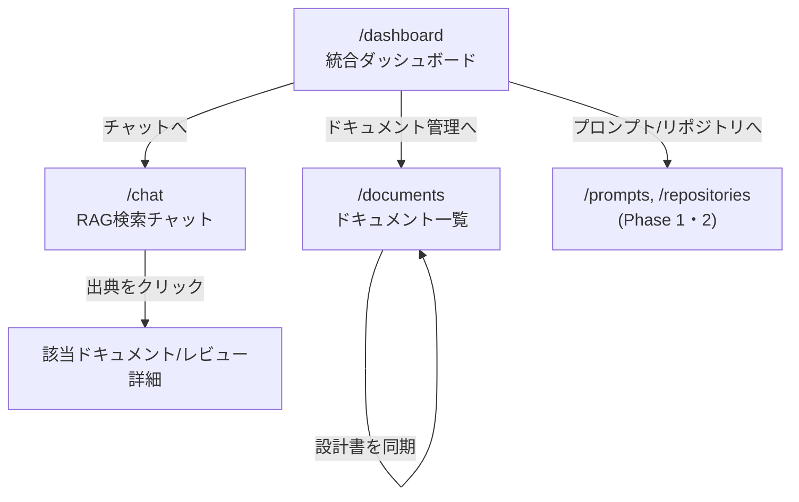

# Phase 3 基本設計書(RAG検索チャットボット)

対象: RAG検索チャットボット(Phase 3)。アーキテクチャ・認証は [`phase1-design.md`](./phase1-design.md) を、DB設計の全体像は [`db-design.md`](./db-design.md) を参照。本ドキュメントはPhase 3で新規に追加するDB・画面・APIをまとめる。**実装完了。**詳細は「実装状況」を参照。

## 概要

設計書(`docs/*.md`・`ai-dev-tool-handoff.md`)やAIレビューの指摘(`ReviewComment`)をベクトル検索の対象として取り込み、自然文の質問に対してClaudeが根拠付きで回答するRAG検索チャットボット。あわせて、プロンプト・レビュー・ドキュメントを横断する統合ダッシュボードを提供する。

- ドキュメント取り込み(リポジトリ内の設計書の同期、または手動貼り付け)
- レビュー指摘の検索対象化(「このエラー、前に指摘されてた?」に答えられるようにする)
- RAG検索チャット(質問→関連チャンク検索→Claudeへの文脈提供→出典付き回答)
- 統合ダッシュボード(プロンプト・リポジトリ・レビュー・ドキュメントの横断サマリ)

## 埋め込みモデル

[Voyage AI](https://www.voyageai.com/)の`voyage-3`(出力1024次元)を採用する。AnthropicがRAG用途で公式に推奨しているモデルであり、Claudeとの組み合わせでの実績が豊富なため。`ANTHROPIC_API_KEY`とは別に`VOYAGE_API_KEY`の発行が必要になる。

- 質問文の埋め込みには`input_type: "query"`、ドキュメント側の埋め込みには`input_type: "document"`を指定する(Voyage APIが非対称検索用に公式に用意しているパラメータで、クエリ・パッセージそれぞれに最適化した埋め込みが得られる)
- チャンク分割は、Markdownの見出し(`##`/`###`)単位を第一境界とし、1チャンクが長すぎる場合(目安2,000文字超)はさらに段落単位で分割する。見出し単位にする理由は、設計書の1セクションが意味的にまとまった単位であり、検索結果をそのまま出典として提示しやすいため
- **既知の制限**: Voyage AIは支払い方法未登録のアカウントだと3RPM/10K TPMに制限される。`POST /api/documents/sync`は全ファイルのチャンクを1回のリクエストにまとめて送るため(2026-08時点でリポジトリ全体で約100チャンク・5万文字)、この制限に達すると429エラーになる。対応は[Voyage AIダッシュボード](https://dashboard.voyageai.com/)で支払い方法を登録すること(voyage-3シリーズの無料枠2億トークンは登録後も適用される)。エラー時は`src/lib/voyage-error-response.ts`がレート制限だと判別できる場合は具体的な案内を返す

## DB設計(案)

pgvector拡張(`CREATE EXTENSION vector`)をここで初めて有効化する。埋め込みベクトル列はPrismaの型システムが直接サポートしないため、`Unsupported("vector(1024)")`として宣言する。Prisma Clientはこの型のフィールドを通常のSELECT/INSERTに含められない制約があるため、埋め込みの読み書きと類似検索は`$queryRaw`/`$executeRaw`で行う方針にする(この制約についてはdb-design.mdにも追記する)。

```mermaid
erDiagram
    USER ||--o{ DOCUMENT : owns
    DOCUMENT ||--o{ DOCUMENT_CHUNK : has
    REVIEWCOMMENT ||--|| REVIEW_COMMENT_EMBEDDING : has

    DOCUMENT {
        string id PK
        string title
        string sourceType
        string sourcePath
        string userId FK
    }
    DOCUMENT_CHUNK {
        string id PK
        int chunkIndex
        string content
        vector embedding "vector(1024), Unsupported"
        string documentId FK
    }
    REVIEW_COMMENT_EMBEDDING {
        string reviewCommentId PK_FK
        vector embedding "vector(1024), Unsupported"
    }
```

- **`Document`** — 取り込んだドキュメント本体。`sourceType`は`MANUAL`(Web画面から直接貼り付け)と`REPO_FILE`(リポジトリ内のファイルを同期)の2種類。`REPO_FILE`の場合のみ`sourcePath`(例: `docs/phase2-design.md`)を持ち、再同期時に同じ`sourcePath`のドキュメントを上書きする
- **`DocumentChunk`** — `Document`を見出し単位で分割した1チャンク。埋め込みベクトルと元テキストを持つ。類似検索のヒット単位はこのテーブル
- **`ReviewCommentEmbedding`** — 既存の`ReviewComment`に対して1:1で埋め込みを追加する。`ReviewComment`本体のスキーマ・既存クエリに影響を与えないよう、あえて別テーブルに分離する(Phase 2のReviewCommentが「AIレビューの指摘」という単一責務を保つのと同じ考え方)

### 類似検索の方針

`DocumentChunk`・`ReviewCommentEmbedding`それぞれに対し、コサイン距離(`<=>`演算子)によるk近傍検索を行う。`ivfflat`または`hnsw`インデックスをこの2テーブルの`embedding`列に張る(データ件数がポートフォリオ規模ではインデックス無しでも十分速いと想定されるが、Phase 2で「後から足すより先に足すほうが安い」と学んだため最初から用意する)。2つのテーブルを跨いだ検索結果は、コサイン距離でマージしてから上位N件をClaudeへの文脈として渡す。

## 画面構成

| パス | 画面 |
| --- | --- |
| `/documents` | 取り込み済みドキュメント一覧・手動登録・リポジトリからの同期 |
| `/chat` | RAG検索チャット(質問→出典付き回答) |
| `/dashboard` | 統合ダッシュボード(プロンプト・リポジトリ・レビュー・ドキュメントの横断サマリ) |

## 画面遷移図



## 画面ごとの詳細

### 1. ドキュメント一覧(`/documents`)

```
┌──────────────────────────────────────────────────────┐
│ ← ダッシュボードへ                                       │
│ ドキュメント                            [設計書を同期]  │
│ [+ 貼り付けて登録]                                        │
├──────────────────────────────────────────────────────┤
│ docs/phase2-design.md      REPO_FILE   3チャンク  [削除]  │
│ 手動メモ: 障害対応手順        MANUAL     1チャンク  [削除]  │
└──────────────────────────────────────────────────────┘
```

- 「設計書を同期」は、**ai-forgeプロジェクト自身の**あらかじめ決めた対象ファイル一覧(`docs/*.md`・`ai-dev-tool-handoff.md`・`README.md`)をサーバー側で読み込み、`sourcePath`ごとに`Document`・`DocumentChunk`を作り直す(差分更新ではなく全置き換え。差分検出のコストより単純さを優先)。ボタン名は当初「リポジトリから同期」だったが、Phase 2の「リポジトリ」機能(GitHubリポジトリの接続)と紛らわしいという指摘を受けて改名した
- 「貼り付けて登録」はタイトル+本文のフォームから`MANUAL`ドキュメントを作成する

### 2. RAG検索チャット(`/chat`)

```
┌──────────────────────────────────────────────────────┐
│ ← ダッシュボードへ                                       │
│ ┌────────────────────────────────────────────────┐  │
│ │ Q. RateLimitBucketの設計判断を教えて               │  │
│ │ A. ユーザー×固定ウィンドウの複合主キーにupsertで…    │  │
│ │    出典: docs/db-design.md                        │  │
│ └────────────────────────────────────────────────┘  │
│ 質問を入力 [_______________________________] [送信]     │
└──────────────────────────────────────────────────────┘
```

- 送信するたびに`POST /api/chat`を呼び、質問文をVoyage AIで埋め込み→`DocumentChunk`・`ReviewCommentEmbedding`から類似度上位を検索→Claudeに「質問+検索結果チャンク」を渡して回答を生成する
- 会話履歴はDBに永続化せず、まずはクライアント側の状態(1セッション内のみ)で保持する(Phase 1のExecution・Phase 2のReviewのような「実行のたびに1レコード」という設計にすると、質問ごとに何を永続化すべきかの判断が増えるため、まずはシンプルな1問1答から始め、必要になれば`ChatMessage`テーブルを追加する)

### 3. 統合ダッシュボード(`/dashboard`)

```
┌──────────────────────────────────────────────────────┐
│ ai-forge ダッシュボード                                  │
├──────────────────────────────────────────────────────┤
│ プロンプト: 12件   接続リポジトリ: 3件                    │
│ 累計レビュー指摘: 58件(CRITICAL 2 / WARNING 20 / INFO 36)│
│ 登録ドキュメント: 8件(24チャンク)                          │
├──────────────────────────────────────────────────────┤
│ [チャットで質問する]  [ドキュメントを管理]                  │
└──────────────────────────────────────────────────────┘
```

- 各サマリはPhase 1・2で既に存在する`Prompt`・`Repository`・`ReviewComment`・新設の`Document`/`DocumentChunk`への単純な`count`/`groupBy`。専用APIは設けず、Phase 2の「傾向」タブと同じ方針でServer Componentから直接Prismaに問い合わせる

## API設計

| メソッド / パス | 概要 |
| --- | --- |
| `GET/POST /api/documents` | 登録済みドキュメント一覧取得・手動登録(埋め込み生成込み) |
| `DELETE /api/documents/:id` | ドキュメント削除(紐づく`DocumentChunk`もカスケード削除) |
| `POST /api/documents/sync` | リポジトリ内の対象ファイルを再取り込みし、チャンク分割・埋め込みを作り直す |
| `POST /api/chat` | 質問文を受け取り、類似検索→Claude呼び出し→出典付き回答を返す |

## レビュー指摘の埋め込みバックフィル

既存の`ReviewComment`(Phase 2ですでに蓄積済み)には`ReviewCommentEmbedding`が無かったため、`POST /api/review-comments/backfill-embeddings`で一括生成できるようにした。1回の呼び出しで未処理分を`LIST_LIMIT`(100件)まで処理し、`remaining: true`が返る間は複数回呼び出す(`/documents`ページの「既存のレビュー指摘を取り込む」ボタンがこれを行う)。新規作成分は`POST /api/repositories/:id/reviews`の中で都度埋め込みを作る(ベストエフォート。失敗してもレビュー自体は成功として返す)。

## RAG検索チャットの回答生成方針

`POST /api/chat`は次の流れで処理する。

1. 質問文をVoyage AI(`input_type: "query"`)で埋め込む
2. `DocumentChunk`・`ReviewCommentEmbedding`それぞれに対しコサイン距離のk近傍検索(上位5件ずつ)を行い、距離でマージして上位5件を採用する(`src/lib/chat-context.ts`)
3. 採用したチャンク・指摘を`[出典N: ...]`形式で文脈として整形し、質問と一緒にClaudeに渡す。「文脈に無いことは憶測で答えない」よう明示的に指示する
4. 検索結果が0件の場合はClaudeを呼ばず、ドキュメント登録・レビュー実行を促す案内文をそのまま返す(コスト最適化と、根拠の無い回答を防ぐため)

この呼び出しは、ユーザーが管理する`PromptVersion`を使う実行ではなくシステム側が組み立てるプロンプトのため、Phase 1・2の`Execution`(`promptVersionId`必須)の枠組みには乗せていない(`src/app/api/chat/route.ts`で直接Claudeを呼ぶ)。

## 実装状況

1. ~~`pgvector`拡張の有効化・`Document`/`DocumentChunk`/`ReviewCommentEmbedding`のマイグレーション追加~~ → 完了。`vector`拡張(0.8.6)を有効化し、`embedding`列へHNSWインデックス(コサイン距離)を追加済み
2. ~~ドキュメント取り込み(`/documents`・手動登録)の実装~~ → 完了。タイトル+本文を送ると`chunkMarkdown()`で見出し単位に分割し、Voyage AI(`voyage-3`)で埋め込みを生成して`DocumentChunk`に保存する。埋め込み生成に失敗した場合はDocument自体を削除し、作り直せる状態に戻す(部分的に検索対象外のDocumentが残らないようにするため)
3. ~~リポジトリファイル同期の実装~~ → 完了。`POST /api/documents/sync`が`docs/*.md`・`README.md`・`ai-dev-tool-handoff.md`を読み込み、ファイル横断で1回のVoyage AI呼び出しにまとめて埋め込みを生成する。再同期時は同じ`sourcePath`のDocumentを丸ごと作り直す(差分検出はしない)。埋め込み生成に失敗した場合はDBへの書き込みを一切行わない
4. ~~既存`ReviewComment`への埋め込みバックフィル~~ → 完了。上記「レビュー指摘の埋め込みバックフィル」参照
5. ~~RAG検索チャット(`/chat`)の実装~~ → 完了。上記「RAG検索チャットの回答生成方針」参照
6. ~~統合ダッシュボード(`/dashboard`)の実装~~ → 完了。プロンプト数・接続リポジトリ数・累計レビュー指摘件数(重要度別)・登録ドキュメント数(チャンク数込み)を表示。専用APIは設けず、Phase 2の「傾向」タブと同じ方針でServer Componentから直接Prismaに問い合わせる(`count`/`groupBy`)

## 今後の拡張候補

- **複数リポジトリの同期・プロジェクト単位のRAG検索**: 現在の「設計書を同期」はai-forge自身のリポジトリ専用で、対象ファイルもコードにハードコードされている。将来的には、Phase 2で接続済みの`Repository`(GitHubリポジトリ)ごとに任意のドキュメント(READMEや設計書)を同期できるようにし、`Document`に`repositoryId`(任意)を持たせて、`/chat`でも「どのプロジェクトを対象に検索するか」を絞り込めるようにすることを検討している。実装時は、GitHub API経由でのファイル一覧取得・取得対象パスの指定方法(全リポジトリ固定ではなくユーザーが選ぶ)・大きいリポジトリでのVoyage AIレート制限対策(バッチ分割)が論点になる
