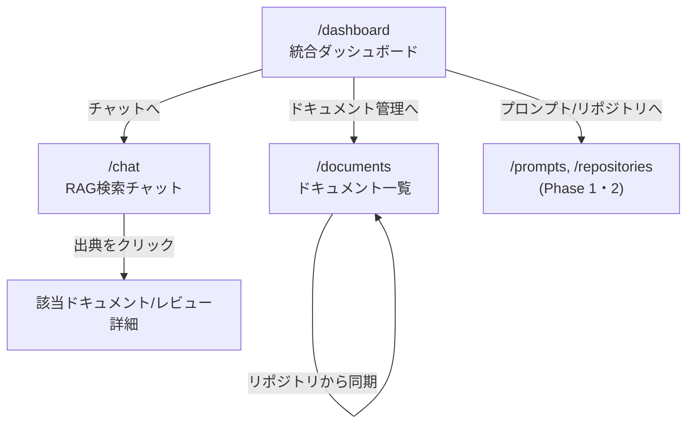

# Phase 3 基本設計書(RAG検索チャットボット)

対象: RAG検索チャットボット(Phase 3)。アーキテクチャ・認証は [`phase1-design.md`](./phase1-design.md) を、DB設計の全体像は [`db-design.md`](./db-design.md) を参照。本ドキュメントはPhase 3で新規に追加するDB・画面・APIをまとめる。**設計のみでまだ実装していない。**

## 概要

設計書(`docs/*.md`・`ai-dev-tool-handoff.md`)やAIレビューの指摘(`ReviewComment`)をベクトル検索の対象として取り込み、自然文の質問に対してClaudeが根拠付きで回答するRAG検索チャットボット。あわせて、プロンプト・レビュー・ドキュメントを横断する統合ダッシュボードを提供する。

- ドキュメント取り込み(リポジトリ内の設計書の同期、または手動貼り付け)
- レビュー指摘の検索対象化(「このエラー、前に指摘されてた?」に答えられるようにする)
- RAG検索チャット(質問→関連チャンク検索→Claudeへの文脈提供→出典付き回答)
- 統合ダッシュボード(プロンプト・リポジトリ・レビュー・ドキュメントの横断サマリ)

## 埋め込みモデル

[Voyage AI](https://www.voyageai.com/)の`voyage-3`(出力1024次元)を採用する。AnthropicがRAG用途で公式に推奨しているモデルであり、Claudeとの組み合わせでの実績が豊富なため。`ANTHROPIC_API_KEY`とは別に`VOYAGE_API_KEY`の発行が必要になる。

- 質問文の埋め込みには`input_type: "query"`、ドキュメント側の埋め込みには`input_type: "document"`を指定する(Voyage APIが非対称検索用に公式に用意しているパラメータで、クエリ・パッセージそれぞれに最適化した埋め込みが得られる)
- チャンク分割は、Markdownの見出し(`##`/`###`)単位を第一境界とし、1チャンクが長すぎる場合(目安2,000文字超)はさらに段落単位で分割する。見出し単位にする理由は、設計書の1セクションが意味的にまとまった単位であり、検索結果をそのまま出典として提示しやすいため

## DB設計(案)

pgvector拡張(`CREATE EXTENSION vector`)をここで初めて有効化する。埋め込みベクトル列はPrismaの型システムが直接サポートしないため、`Unsupported("vector(1024)")`として宣言する。Prisma Clientはこの型のフィールドを通常のSELECT/INSERTに含められない制約があるため、埋め込みの読み書きと類似検索は`$queryRaw`/`$executeRaw`で行う方針にする(この制約についてはdb-design.mdにも追記する)。

```mermaid
erDiagram
    USER ||--o{ DOCUMENT : owns
    DOCUMENT ||--o{ DOCUMENT_CHUNK : has
    REVIEWCOMMENT ||--|| REVIEW_COMMENT_EMBEDDING : has

    DOCUMENT {
        string id PK
        string title
        string sourceType
        string sourcePath
        string userId FK
    }
    DOCUMENT_CHUNK {
        string id PK
        int chunkIndex
        string content
        vector embedding "vector(1024), Unsupported"
        string documentId FK
    }
    REVIEW_COMMENT_EMBEDDING {
        string reviewCommentId PK_FK
        vector embedding "vector(1024), Unsupported"
    }
```

- **`Document`** — 取り込んだドキュメント本体。`sourceType`は`MANUAL`(Web画面から直接貼り付け)と`REPO_FILE`(リポジトリ内のファイルを同期)の2種類。`REPO_FILE`の場合のみ`sourcePath`(例: `docs/phase2-design.md`)を持ち、再同期時に同じ`sourcePath`のドキュメントを上書きする
- **`DocumentChunk`** — `Document`を見出し単位で分割した1チャンク。埋め込みベクトルと元テキストを持つ。類似検索のヒット単位はこのテーブル
- **`ReviewCommentEmbedding`** — 既存の`ReviewComment`に対して1:1で埋め込みを追加する。`ReviewComment`本体のスキーマ・既存クエリに影響を与えないよう、あえて別テーブルに分離する(Phase 2のReviewCommentが「AIレビューの指摘」という単一責務を保つのと同じ考え方)

### 類似検索の方針

`DocumentChunk`・`ReviewCommentEmbedding`それぞれに対し、コサイン距離(`<=>`演算子)によるk近傍検索を行う。`ivfflat`または`hnsw`インデックスをこの2テーブルの`embedding`列に張る(データ件数がポートフォリオ規模ではインデックス無しでも十分速いと想定されるが、Phase 2で「後から足すより先に足すほうが安い」と学んだため最初から用意する)。2つのテーブルを跨いだ検索結果は、コサイン距離でマージしてから上位N件をClaudeへの文脈として渡す。

## 画面構成

| パス | 画面 |
| --- | --- |
| `/documents` | 取り込み済みドキュメント一覧・手動登録・リポジトリからの同期 |
| `/chat` | RAG検索チャット(質問→出典付き回答) |
| `/dashboard` | 統合ダッシュボード(プロンプト・リポジトリ・レビュー・ドキュメントの横断サマリ) |

## 画面遷移図



## 画面ごとの詳細

### 1. ドキュメント一覧(`/documents`)

```
┌──────────────────────────────────────────────────────┐
│ ← ダッシュボードへ                                       │
│ ドキュメント                          [リポジトリから同期]  │
│ [+ 貼り付けて登録]                                        │
├──────────────────────────────────────────────────────┤
│ docs/phase2-design.md      REPO_FILE   3チャンク  [削除]  │
│ 手動メモ: 障害対応手順        MANUAL     1チャンク  [削除]  │
└──────────────────────────────────────────────────────┘
```

- 「リポジトリから同期」は、あらかじめ決めた対象ファイル一覧(`docs/*.md`・`ai-dev-tool-handoff.md`・`README.md`)をサーバー側で読み込み、`sourcePath`ごとに`Document`・`DocumentChunk`を作り直す(差分更新ではなく全置き換え。差分検出のコストより単純さを優先)
- 「貼り付けて登録」はタイトル+本文のフォームから`MANUAL`ドキュメントを作成する

### 2. RAG検索チャット(`/chat`)

```
┌──────────────────────────────────────────────────────┐
│ ← ダッシュボードへ                                       │
│ ┌────────────────────────────────────────────────┐  │
│ │ Q. RateLimitBucketの設計判断を教えて               │  │
│ │ A. ユーザー×固定ウィンドウの複合主キーにupsertで…    │  │
│ │    出典: docs/db-design.md                        │  │
│ └────────────────────────────────────────────────┘  │
│ 質問を入力 [_______________________________] [送信]     │
└──────────────────────────────────────────────────────┘
```

- 送信するたびに`POST /api/chat`を呼び、質問文をVoyage AIで埋め込み→`DocumentChunk`・`ReviewCommentEmbedding`から類似度上位を検索→Claudeに「質問+検索結果チャンク」を渡して回答を生成する
- 会話履歴はDBに永続化せず、まずはクライアント側の状態(1セッション内のみ)で保持する(Phase 1のExecution・Phase 2のReviewのような「実行のたびに1レコード」という設計にすると、質問ごとに何を永続化すべきかの判断が増えるため、まずはシンプルな1問1答から始め、必要になれば`ChatMessage`テーブルを追加する)

### 3. 統合ダッシュボード(`/dashboard`)

```
┌──────────────────────────────────────────────────────┐
│ ai-forge ダッシュボード                                  │
├──────────────────────────────────────────────────────┤
│ プロンプト: 12件   接続リポジトリ: 3件                    │
│ 累計レビュー指摘: 58件(CRITICAL 2 / WARNING 20 / INFO 36)│
│ 登録ドキュメント: 8件(24チャンク)                          │
├──────────────────────────────────────────────────────┤
│ [チャットで質問する]  [ドキュメントを管理]                  │
└──────────────────────────────────────────────────────┘
```

- 各サマリはPhase 1・2で既に存在する`Prompt`・`Repository`・`ReviewComment`・新設の`Document`/`DocumentChunk`への単純な`count`/`groupBy`。専用APIは設けず、Phase 2の「傾向」タブと同じ方針でServer Componentから直接Prismaに問い合わせる

## API設計

| メソッド / パス | 概要 |
| --- | --- |
| `GET/POST /api/documents` | 登録済みドキュメント一覧取得・手動登録(埋め込み生成込み) |
| `DELETE /api/documents/:id` | ドキュメント削除(紐づく`DocumentChunk`もカスケード削除) |
| `POST /api/documents/sync` | リポジトリ内の対象ファイルを再取り込みし、チャンク分割・埋め込みを作り直す |
| `POST /api/chat` | 質問文を受け取り、類似検索→Claude呼び出し→出典付き回答を返す |

## レビュー指摘の埋め込みバックフィル

既存の`ReviewComment`(Phase 2ですでに蓄積済み)には`ReviewCommentEmbedding`が無いため、Phase 3実装時に一括で埋め込みを生成するバックフィル処理が別途必要になる(新規作成分は`POST /api/repositories/:id/reviews`の中で都度埋め込みを作る想定)。

## 実装状況

未実装。設計のみ。実装時は以下の順で進める想定。

1. `pgvector`拡張の有効化・`Document`/`DocumentChunk`/`ReviewCommentEmbedding`のマイグレーション追加
2. ドキュメント取り込み(`/documents`・手動登録)の実装
3. リポジトリファイル同期の実装
4. 既存`ReviewComment`への埋め込みバックフィル
5. RAG検索チャット(`/chat`)の実装
6. 統合ダッシュボード(`/dashboard`)の実装
