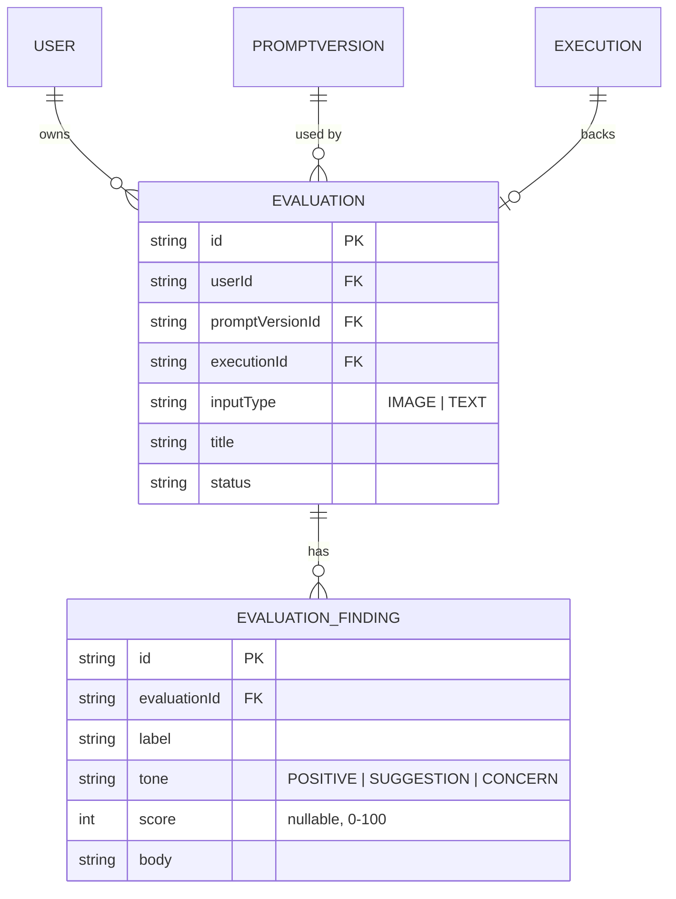

# Phase 5 基本設計書(汎用AI評価ツール)

対象: コードレビューに限定していたAI評価機能を、画像・テキストなど他の入力形式にも対象を広げる。アーキテクチャ・認証は [`phase1-design.md`](./phase1-design.md) を、DB設計の全体像は [`db-design.md`](./db-design.md) を参照。**設計のみ。実装は未着手。**

## 概要

Phase 2(AIコードレビュー)は、実質的には「Prompt(バージョン管理)→Execution(実行)→構造化出力での指摘」という汎用的な仕組みの上に、GitHubのPR diffという1つの入力形式だけを乗せたものだった。この仕組み自体はコードに限定される理由が無いため、料理の写真・自作の絵・文章など、他の入力形式にも対象を広げる。

- ユーザーが画像またはテキストをアップロード/入力する
- 評価用のプロンプト(Phase 1の`Prompt`資産を再利用)を選ぶ
- Claudeが構造化出力で評価コメントを返す(コメントごとにラベル・トーン・本文)
- 結果は保存され、一覧・詳細で確認できる

## スコープの決定: Reviewとは分離する

Phase 2の`Review`/`ReviewComment`はPRの`filePath`/`line`など、コード固有のフィールドを持ち、「レビュー履歴・傾向」ダッシュボードやRAGチャットの出典表示など既に深く統合されている。ここを無理に汎用化して壊すリスクを避けるため、**`Review`はコードレビュー専用のまま残し、新しく`Evaluation`という並行した概念を追加する**方針にする。

- 将来的に「コードレビューも`Evaluation`の一種(`inputType: GITHUB_PR`)」として統合する余地は残すが、Phase 5では扱わない
- 呼び出すAI・プロンプトの仕組み(`runAiExecution()`、`Execution`)はそのまま共用する

## 対応する入力形式

| 入力形式 | 実現方式 | 備考 |
| --- | --- | --- |
| 画像(`IMAGE`) | Claude Vision(Messages APIの画像入力)にBase64で直接渡す | 料理の写真、自作の絵など |
| テキスト(`TEXT`) | 既存のプロンプト実行と同じ`{{変数名}}`展開 | 歌詞・楽譜のテキスト化した楽曲、文章など |

**音声について**: Claude APIは音声そのものを解析できない(2026-08時点)。「自作の曲を評価してほしい」という要望には、楽曲そのものではなく歌詞・楽譜・曲の説明文をテキストとして入力する形で対応する。音源そのものの分析(リズム・音程等)を行いたい場合は別サービスとの連携が必要になり、Phase 5のスコープ外とする。

## 画像の扱い: 保存しない方針

画像アップロード機能を作ると「アップロードされた画像をどこに保存するか」という問題が付随する(現状S3等のオブジェクトストレージ連携が無い)。Phase 5の最初のバージョンでは、**画像はDBやストレージに永続化せず、リクエストの中でClaudeに渡すだけにする**(結果のテキストのみ保存)。理由:

- ストレージ連携(Vercel Blob等)を新たに増やすと、環境変数・料金・本番デプロイでの動作確認がもう1セット必要になり、Phase 5のスコープが一気に膨らむ
- 評価結果(テキスト)さえ残っていれば、機能としての価値(「AIに評価してもらう」)は成立する
- 「アップロードした写真を結果画面に並べて表示したい」という要望が実際に出てきた時点で、Vercel Blob導入を再検討する(`今後の拡張候補`に記載)

## DB設計(案)



- **`Evaluation`** — 1回の評価実行。`Review`と同じく`promptVersionId`(Restrict。評価に使ったプロンプトは辿れるようにする)・`executionId`(SetNull。実行ログの扱いはReviewと揃える)を持つ。`title`はユーザーが付ける任意のラベル(例:「今日の夕食」)。`inputType`で画像/テキストを区別する
- **`EvaluationFinding`** — `ReviewComment`の`severity`/`filePath`/`line`をコード非依存な形に置き換えたもの。`label`は自由記述の観点名(例:「彩り」「栄養バランス」「構図」)、`tone`はPOSITIVE/SUGGESTION/CONCERNの3値(`ReviewCommentSeverity`のINFO/WARNING/CRITICALと語彙は違うが構造は同じ)、`score`は任意の0-100スコア(評価用途によっては使わなくてもよい)

## 構造化出力スキーマ(案)

```ts
const EvaluationFindingSchema = z.object({
  label: z.string(),
  tone: z.enum(["POSITIVE", "SUGGESTION", "CONCERN"]),
  score: z.number().int().min(0).max(100).nullable(),
  body: z.string(),
});

const EvaluationOutputSchema = z.object({
  summary: z.string(),
  findings: z.array(EvaluationFindingSchema),
});
```

`ReviewOutputSchema`(`src/lib/review-schema.ts`)とほぼ同じ形にすることで、`runAiExecution()`を経由した構造化出力の扱い方をそのまま流用できる。`summary`はコードレビューには無かったフィールドで、写真・文章評価では「総評」を一言添えたいユースケースが多いため追加する。

## 画面構成

| パス | 画面 |
| --- | --- |
| `/evaluations` | 評価一覧・新規作成(画像アップロード or テキスト入力+プロンプト選択) |
| `/evaluations/:id` | 評価結果詳細(総評+観点別コメント) |

## API設計(案)

| メソッド・パス | 内容 |
| --- | --- |
| `POST /api/evaluations` | 画像(Base64)またはテキスト+`promptId`を受け取り、Claudeで評価を実行して`Evaluation`/`EvaluationFinding`を作成 |
| `GET /api/evaluations` | 一覧取得(`LIST_LIMIT`で上限) |
| `GET /api/evaluations/:id` | 詳細取得 |
| `DELETE /api/evaluations/:id` | 削除 |

画像評価はClaude Vision呼び出しがコードレビューより時間がかかる可能性があるため、`POST /api/evaluations`は最初から「今後の拡張候補」のバックグラウンド処理を見据えた設計(`Execution`と同じ`PENDING`ステータスの概念を持たせる)にしておく。Phase 5の最初のバージョンでは同期実行のままでもよいが、レスポンスの形は非同期化してもクライアント側の変更が最小で済むようにしておく。

## レート制限

既存の`src/lib/rate-limit.ts`のパターン(ユーザー×用途の1時間あたり上限)を`purpose: "evaluation"`として追加する。画像はテキストよりトークン消費が大きいため、実行系(`checkExecutionRateLimit`)とは別カウンタにする。

## 実装方針(段階的ロールアウト)

1. まず画像評価のみをプロトタイプ実装する(テキスト評価は既存の`{{変数名}}`実行とほぼ同じなので後回しでよい)
2. `EvaluationOutputSchema`が実際の用途(料理・絵など)でうまく機能するか、手動でいくつか試して検証してから`/evaluations`画面を作り込む
3. 汎用化の手応えが良ければ、プロンプトテンプレート集(今後の拡張候補)を用意して他の用途を試しやすくする

## 今後の拡張候補

- **画像の永続化**: Vercel Blob等を導入し、アップロードした画像を結果画面に表示できるようにする
- **バックグラウンド処理**: `Evaluation.status`を`PENDING`→`SUCCESS`/`FAILED`で管理し、処理完了をトースト通知する(`ai-dev-tool-handoff.md`の次のステップ候補と連動)
- **評価結果の共有リンク**: `Evaluation`を読み取り専用の公開URLで共有できるようにする
- **プロンプトテンプレート集**: 料理・楽曲・絵など、評価用途別の叩き台プロンプトを用意する
- **音声対応**: 音声解析サービスとの連携(Phase 5では見送り)
