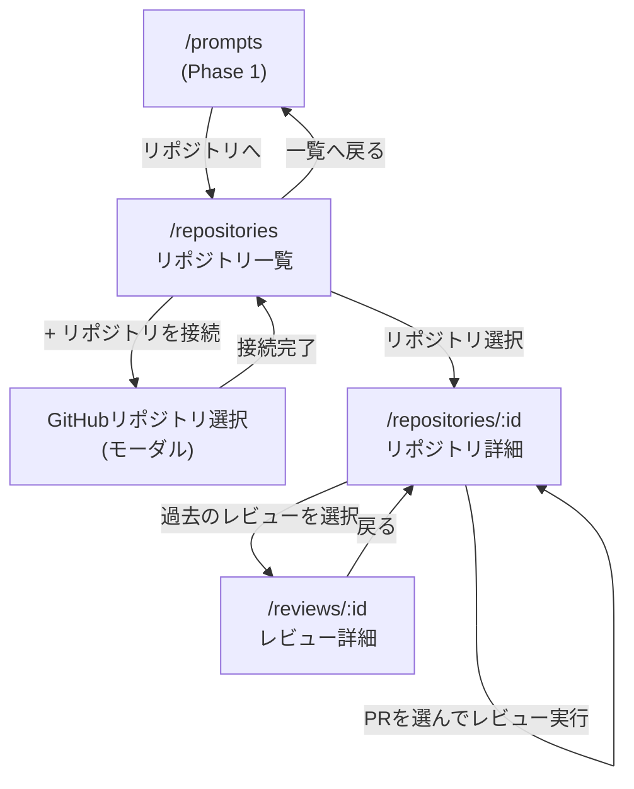
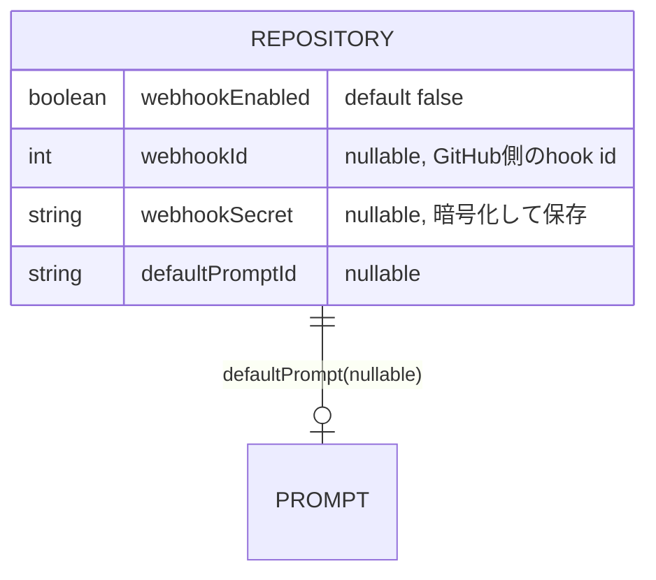
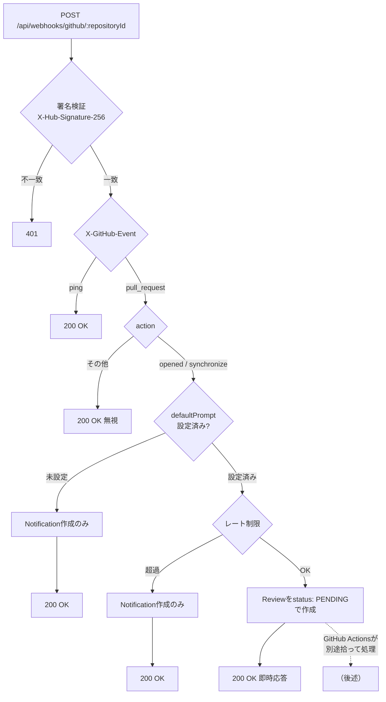
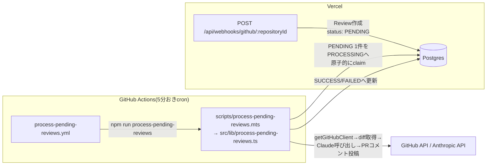

# Phase 2 基本設計書(画面遷移・UI設計)

対象: AIコードレビューツール(Phase 2)。アーキテクチャ・認証は [`phase1-design.md`](./phase1-design.md) を、DB設計は [`db-design.md`](../db-design.md) の「Phase 2の設計判断」を参照。本ドキュメントはPhase 2で新規に追加する画面・APIをまとめる。実行系APIのレート制限・確認ダイアログのアクセシビリティ対応など、Phase 2の画面にも適用されている品質・UX改善タスクの設計判断は [`quality-improvements.md`](../quality-improvements.md) を参照。

## 概要

接続したGitHubリポジトリのオープンなPRに対し、Phase 1で管理しているプロンプト資産を使ってAIレビューを実行し、指摘事項を蓄積するツール。

- GitHub連携(接続したリポジトリのオープンなPRを一覧表示)
- AIレビュー機能(選んだプロンプト×選んだPRの差分をClaudeに解析させる)
- レビュー結果の蓄積(指摘をDBに保存し、重要度別に一覧・集計する)

GitHub OAuthのアクセストークンはPhase 1のログインで取得済みの`Account.access_token`を再利用する。ただし現在のスコープ(デフォルト)ではプライベートリポジトリの差分取得ができないため、`repo`スコープの追加同意が必要になる想定(GitHub連携実装時に対応)。

## 画面構成

| パス | 画面 |
| --- | --- |
| `/repositories` | 接続済みリポジトリ一覧・GitHubリポジトリの接続 |
| `/repositories/:id` | リポジトリ詳細(オープンなPR一覧・レビュー実行・レビュー履歴) |
| `/reviews/:id` | レビュー詳細(指摘事項の一覧) |

Phase 1の`/prompts`ヘッダーに「リポジトリ」リンクを追加し、`/repositories`への導線とする。

## 画面遷移図



## 画面ごとの詳細

### 1. リポジトリ一覧(`/repositories`)

```
┌──────────────────────────────────────────────────────┐
│ ← プロンプト一覧へ                                       │
│ 接続済みリポジトリ                    [+ リポジトリを接続]  │
├──────────────────────────────────────────────────────┤
│ owner/repo-a         最終レビュー: 2026-08-20  [開く][解除]│
│ owner/repo-b         レビューなし              [開く][解除]│
└──────────────────────────────────────────────────────┘
```

- 「+ リポジトリを接続」→GitHub APIから取得した自分のリポジトリ一覧をモーダルで表示し、選んだものを`POST /api/repositories`で接続する
- 「解除」は`DELETE /api/repositories/:id`。接続解除すると、そのリポジトリに紐づく`Review`・`ReviewComment`もカスケード削除される(db-design.md参照)ため、確認ダイアログに件数を表示する

### 2. リポジトリ詳細(`/repositories/:id`)

```
┌──────────────────────────────────────────────────────┐
│ ← リポジトリ一覧へ    owner/repo-a                        │
│ [オープンなPR] [レビュー履歴] [傾向]                        │
├──────────────────────────────────────────────────────┤
│ #42 Add feature X                     [レビューを実行]    │
│   使用するプロンプト: [コードレビュー v3 ▾]                 │
│ #41 Fix bug Y                         [レビューを実行]    │
└──────────────────────────────────────────────────────┘
```

- 「オープンなPR」タブ: `GET /api/repositories/:id/pulls`でGitHub APIをその場で呼び出し表示する(DBには保存しない)。使用するプロンプトはユーザーの`Prompt`一覧から選択(バージョンは常に最新を使用)
- 「レビュー履歴」タブ: 過去の`Review`を新しい順に一覧し、各行に指摘件数を表示する
- 「傾向」タブ: そのリポジトリでの累計指摘件数(重要度別)、直近10件のレビューの重要度内訳(積み上げバー)、指摘の多いファイルTOP8を表示する。すべて`ReviewComment`に対する`groupBy`集計で、`/repositories/:id`のServer Componentが直接Prismaへ問い合わせる(専用APIは設けていない)。これがPhase 2スコープでの「傾向の可視化」にあたる(リポジトリ横断のダッシュボードはPhase 3で扱う)

### 3. レビュー詳細(`/reviews/:id`)

```
┌──────────────────────────────────────────────────────┐
│ ← リポジトリへ戻る    #42 Add feature X                   │
│ status: SUCCESS   実行: 2026-08-23 18:10   claude-opus-5 │
│ CRITICAL 0   WARNING 2   INFO 3                          │
├──────────────────────────────────────────────────────┤
│ src/foo.ts:10  [WARNING]                                 │
│   未使用の変数があります                                  │
│ src/bar.ts:—   [INFO]                                    │
│   ...                                                     │
└──────────────────────────────────────────────────────┘
```

- `GET /api/reviews/:id`。`Review`本体(PR情報・status・使用モデル・トークン数など`Execution`経由の情報)と`ReviewComment`一覧(ファイルパス順)を表示
- `status: FAILED`の場合は指摘一覧の代わりにエラーメッセージを表示(Phase 1のExecution失敗表示と同じ考え方)

## API設計

| メソッド / パス | 概要 |
| --- | --- |
| `GET/POST /api/repositories` | 接続済みリポジトリ一覧取得・新規接続 |
| `DELETE /api/repositories/:id` | 接続解除(Review・ReviewCommentもカスケード削除) |
| `GET /api/repositories/:id/pulls` | GitHub APIをプロキシしてオープンなPR一覧を取得(非保存) |
| `GET /api/repositories/:id/reviews` | リポジトリのレビュー履歴取得 |
| `POST /api/repositories/:id/reviews` | 指定PR・プロンプトでAIレビューを実行し、Review・Execution・ReviewCommentを作成 |
| `GET /api/reviews/:id` | レビュー詳細(指摘一覧を含む) |

## レビュー実行の設計方針

`POST /api/repositories/:id/reviews`は次の流れで処理する。

1. GitHub APIで指定PRのdiff(unified diff形式)を取得する
2. 選択された`PromptVersion`の本文にdiffを変数(`{{diff}}`)として展開する(Phase 1の変数置換ロジック`src/lib/prompt-variables.ts`を再利用)
3. Claudeの[構造化出力](https://docs.anthropic.com)(`output_config.format`)で、指摘事項を`{ findings: [{ filePath, line, severity, body }] }`形式のJSONとして返すよう指定する。自由記述のテキストをパースするのではなく、スキーマで型を保証する
4. `Execution`(AI呼び出しの記録)と`Review`(PRの文脈)を作成し、`findings`をそのまま`ReviewComment`として保存する

構造化出力のスキーマは`src/lib/review-schema.ts`でZodにより定義し、`@anthropic-ai/sdk/helpers/zod`の`zodOutputFormat`経由で`client.messages.parse`に渡している(`parsed_output`が型安全に得られる)。

## 実装状況

1. ~~GitHub連携の実装~~ → 完了。`repo`スコープの追加、`octokit`によるリポジトリ接続・PR取得API、`/repositories`・`/repositories/:id`画面
2. ~~AIレビュー機能の実装~~ → 完了。`POST /api/repositories/:id/reviews`でPRのdiffを`{{diff}}`変数に展開し、構造化出力でレビュー結果を取得。`/repositories/:id`の「レビューを実行」・`/reviews/:id`画面
3. ~~レビュー結果の蓄積・可視化~~ → 完了(リポジトリ単位)。`/repositories/:id`に「傾向」タブを追加し、累計指摘件数(重要度別)・直近10件のレビューの重要度内訳・指摘の多いファイルTOP8を表示。リポジトリ横断のダッシュボードはPhase 3で扱う

Phase 2完了後、`Review`は以下の横断機能の対象にもなった(いずれもPhase 2固有ではなく複数ドメインにまたがる機能のため、設計の詳細は追加先のドキュメントを参照): レビュー結果の比較機能(追加機能アイデア、[`ai-dev-tool-handoff.md`](../../ai-dev-tool-handoff.md)参照)、チャットからの直接アクション実行に伴う`triggeredVia`列([`phase4-design.md`](./phase4-design.md)項目4)、共有リンク([`phase5-design.md`](./phase5-design.md)「共有リンク」)。

## Webhook自動レビュー(Issue #106)

対象: PRの作成・更新をGitHub Webhookで受け取り、`/repositories/:id`の「オープンなPR」タブからの手動実行と並ぶもう一つのトリガーとして、AIレビューを自動実行できるようにする。

### アーキテクチャ: GitHub OAuth Appだからこそのリポジトリ単位Webhook

このアプリはGitHub App(インストール単位でWebhookが一元管理される)ではなく、ユーザーごとのOAuthアクセストークン(`repo`スコープ、`src/lib/github.ts`)でGitHub APIを呼んでいる。そのため「アプリ全体で1つのWebhook」という構成は取れず、**接続済みリポジトリごとに個別のWebhookをAPI経由で作成・削除する**(`octokit.rest.repos.createWebhook`/`deleteWebhook`、既存の`repo`スコープに含まれる権限で実行可能・追加の同意は不要)。

Webhookのsecretはリポジトリごとにアプリ側でランダム生成し(`crypto.randomBytes(32).toString("hex")`)、GitHubのaccess_tokenと同じ`src/lib/token-crypto.ts`の`encryptToken`で暗号化してDBに保存する。受信時はこのsecretで`X-Hub-Signature-256`を検証する。

### Webhook宛先URLにRepository.idを含める

`Repository`の一意制約は`[userId, githubRepoId]`であり、同じ実GitHubリポジトリを複数のai-forgeユーザーがそれぞれ個別に接続しうる。受信ペイロードの`repository.id`(GitHub側のID)だけでは対象の`Repository`レコードを一意に特定できないため、**宛先URLにai-forge内部の`Repository.id`を含めて一意に紐付ける**。

```
POST /api/webhooks/github/:repositoryId
```

公開URLの組み立ては新しい環境変数を増やさず、既存の`NEXTAUTH_URL`を再利用する(`${NEXTAUTH_URL}/api/webhooks/github/${repository.id}`)。ローカル開発環境(`http://localhost:3000`)はGitHubから到達できないため、Webhook自動レビューは実質的に公開URLを持つ本番デプロイでのみ動作する制約がある。

### DB設計(Repositoryテーブルの拡張)



- `webhookEnabled`が`true`になるのは、GitHub側へのWebhook作成に成功し`defaultPromptId`も設定できた場合のみ(UIでも未選択のプロンプトでは有効化ボタンを押せないようにする)
- `defaultPromptId`は`onDelete: SetNull`。プロンプト削除後にPRイベントを受けた場合は「プロンプト未設定」としてスキップし、Notificationで知らせる(後述)
- `Prompt`側に`defaultForRepositories Repository[]`の逆参照を追加(Prismaの双方向リレーション要件)

### ReviewTriggerにWEBHOOKを追加

```
enum ReviewTrigger {
  UI
  CHAT
  WEBHOOK
}
```

`/repositories/:id`のレビュー履歴・`/reviews/:id`で、既存の`UI`/`CHAT`と同様に表示する(表示ロジックの追加改修のみで済む)。

### Webhook受信エンドポイントの処理フロー

> **2026-09-01追記**: 本番運用開始直後、`scheduleBackground()`(`after()`)によるレビュー本体の実行がVercel Hobbyプランのmax duration(60秒)を超過し無言で強制終了される事象が発生した(PR取得・埋め込み生成等の前後処理と合わせて60秒を超えうるため、Anthropic呼び出し単体へのSDK側`timeout`指定だけでは防ぎきれない)。Webhook受信とレビュー実行を別リクエストに分離するVercel Queues(Beta)への移行を試みたが、**本アカウント(Hobby)では同機能が実際には有効化されておらず**(ダッシュボードにQueues関連の管理画面が存在せず、送信したメッセージを消費するコンシューマーが呼ばれない=レビューが一切実行されなくなる重大な退行)、ロールバックした。現状は`scheduleBackground()`のまま、Anthropic呼び出しのSDK側`timeout`を35秒に短縮し前後処理の余白を厚くする暫定対応に留めている(根本解決ではなく、大きなPRでは依然タイムアウトしうる)。恒久対応としてGitHub Actionsを処理ワーカーとして使う方式(Issue #129)を採用する方針だが、まずはこの暫定対応で運用しながら様子を見る(2026-09-02、ユーザーと相談のうえ決定)。
>
> **2026-09-02追記(Issue #129実装)**: 上記の暫定対応(35秒timeout)はVercelの実行時間上限そのものを回避できておらず、下記の設計へ置き換えた。詳細は次節「Webhook自動レビューの非同期化(GitHub Actionsワーカー、Issue #129)」を参照。



- 署名検証は生のリクエストボディ(`request.text()`)に対して行い、検証後に初めて`JSON.parse`する。比較は`crypto.timingSafeEqual`でタイミング攻撃を避ける
- 対象イベントは`pull_request`の`opened`・`synchronize`のみ(re-open等その他のactionは無視して200を返す)。GitHubは配信失敗(4xx/5xx)が続くとWebhookを自動的に無効化してしまうため、署名不一致(401)以外の「ai-forge側で意図的にスキップした」ケース(プロンプト未設定・レート制限超過・対象外action)はすべて200を返す
- レート制限は既存の`checkExecutionRateLimit`(1時間20回)をそのまま使う。手動実行と同じ"execution"カウンタを共有し、連続pushによる多重実行もこの枠で自然に抑制する
- 実際のレビュー処理(diff取得→`runAiExecution`→Review/ReviewComment作成→埋め込み生成→GitHub PRへのコメント投稿)を行う`runRepositoryReview()`(`src/lib/run-repository-review.ts`)は`POST /api/repositories/:id/reviews`(手動実行)と共通。Webhook経路では下記のGitHub Actionsワーカーから`existingReviewId`付きで呼ばれ、Vercel上では実行しない(2026-09-02、Issue #129実装以降)

### Webhook自動レビューの非同期化(GitHub Actionsワーカー、Issue #129)

Vercel Hobbyプランのmax duration(60秒)そのものから解放するため、**レビュー処理本体(PR取得→Claude呼び出し→DB書き込み→PRコメント投稿)をVercel上では実行せず、GitHub Actionsのジョブ内で完結させる**。単にGitHub ActionsからVercelのAPIエンドポイントを呼び出すだけでは、呼び出された先が結局Vercelのサーバーレス関数である限り同じ60秒制限に縛られたままで根本解決にならない、という点が設計上の要点(Issue #129本文参照)。



- **PENDING→PROCESSINGのclaim**: `UPDATE Review SET status = 'PROCESSING' WHERE id = ? AND status = 'PENDING'`相当の条件付き更新(Prismaの`updateMany`+`where: { status: "PENDING" }`)で、対象行が既に他の実行にclaimされていれば0件更新となり、次の候補へスキップする。`ReviewStatus`に`PENDING`/`SUCCESS`/`FAILED`に加え`PROCESSING`を追加した
- **多重実行防止**: ワークフロー自体は`concurrency: { group: process-pending-reviews, cancel-in-progress: false }`で同時実行を防ぐ(前回実行中は次のcronをスキップし待たせない。取りこぼしは次の5分後の実行で処理される)。上記のclaimは手動re-run等で万一重なった場合の保険
- **トークン復号**: GitHubアクセストークンの暗号化(`src/lib/token-crypto.ts`)は全ユーザー共通の単一鍵(`TOKEN_ENCRYPTION_KEY`、SHA-256でAES-256鍵に変換)のため、GitHub Actions Secretsに1つ登録するだけで復号できる(ユーザーごとの鍵管理は不要)
- **実行頻度と予算**: このリポジトリはPublicのため、GitHub Actionsの実行時間は無料枠の制約を受けない(Privateなら月2,000分)。5分おきのcronで運用する。GitHubのscheduled workflowは仕様上「厳密な時刻に実行される保証がない」(数分〜十数分の遅延がありうる)ため、Webhook受信からレビュー完了までのタイムラグはこの範囲で発生しうる
- **1回の実行で処理する件数の上限**: `BATCH_LIMIT`(20件)を設け、無制限に処理し続けて次のcronと重なることを防ぐ
- **手動実行は対象外**: `POST /api/repositories/:id/reviews`(UIからの手動実行・チャットからの直接実行)は即時性が求められるため、引き続きVercel側で同期実行のまま(`runRepositoryReview()`を`existingReviewId`無しで直接呼ぶ)。SDK側`timeout`(35秒)によるFAILED化もこの経路にのみ残す
- **必要なGitHub Actions Secrets**: `DATABASE_URL`・`TOKEN_ENCRYPTION_KEY`・`ANTHROPIC_API_KEY`・`VOYAGE_API_KEY`・`GH_OAUTH_CLIENT_ID`/`GH_OAUTH_CLIENT_SECRET`(GitHubアクセストークンのリフレッシュ用、Actionsの予約プレフィックス`GITHUB_`を避けた別名で登録し、ワークフロー内で`GITHUB_CLIENT_ID`/`GITHUB_CLIENT_SECRET`にマッピングする)・`NEXTAUTH_URL`(PRコメントに載せる共有リンクの組み立て用)。値はVercelの本番環境変数と同じものをリポジトリのActions Secretsに個別登録する必要がある(手動作業、READMEに手順を記載)

### 画面(`/repositories/:id`に「Webhook設定」タブを追加)

```
┌──────────────────────────────────────────────────────┐
│ [オープンなPR] [レビュー履歴] [傾向] [Webhook設定]         │
├──────────────────────────────────────────────────────┤
│ 自動レビュー: [ 無効 ●───○ 有効 ]                         │
│ デフォルトプロンプト: [コードレビュー v3 ▾]                  │
│ PRの作成・更新(open/synchronize)時に自動でレビューします    │
└──────────────────────────────────────────────────────┘
```

- プロンプト選択は`pull-request-list.tsx`と同じ`usesDiff`(本文に`{{diff}}`を含むか)の警告表示を流用する
- 有効化: `POST /api/repositories/:id/webhook`(body: `{ promptId }`)。GitHub側にWebhookを作成した後にDBへ保存する(GitHub側が先に失敗すればDBも更新しない)
- デフォルトプロンプトの変更: 同じAPIを再度呼ぶ。Webhook自体(secret・宛先URL)は変わらないため、GitHub側の再作成は行わずDBの`defaultPromptId`のみ更新する
- 無効化: `DELETE /api/repositories/:id/webhook`。GitHub側のWebhookを削除してからDBのフィールドをクリアする
- リポジトリ接続解除(`DELETE /api/repositories/:id`)でWebhookが有効なままの場合、削除前にGitHub側のWebhook削除を試みる(失敗してもベストエフォートでリポジトリ自体の削除は継続する。孤立したWebhookが残ってもGitHub側で無害だが、可能な範囲で片付ける)

### API設計

| メソッド/パス | 概要 |
| --- | --- |
| `POST /api/repositories/:id/webhook` | Webhook自動レビューを有効化(未作成なら作成)・デフォルトプロンプトを更新 |
| `DELETE /api/repositories/:id/webhook` | Webhook自動レビューを無効化(GitHub側のWebhookも削除) |
| `POST /api/webhooks/github/:repositoryId` | GitHubからのWebhook受信(署名検証・`pull_request`イベント処理、セッション認証なし) |

### 見送る点(v1のスコープ外)

- Organization・複数リポジトリへの一括設定(まずリポジトリ単位のON/OFFのみ)
- `pull_request_review`等、`pull_request`以外のイベント種別
- Webhook配信ログの独自保持(GitHub側の「Recent Deliveries」で足りるため、アプリ側では持たない)

### 実装状況

実装完了(`feature/webhook-auto-review`ブランチ)。設計どおり以下を実装。

- `Repository`に`webhookEnabled`/`webhookId`/`webhookSecret`/`defaultPromptId`を追加し、`ReviewTrigger`に`WEBHOOK`を追加するマイグレーション
- レビュー本体の処理を`src/lib/run-repository-review.ts`に共通化し、`POST /api/repositories/:id/reviews`(手動)・`POST /api/webhooks/github/:repositoryId`(Webhook)の両方から呼ぶ形にリファクタ
- `POST/DELETE /api/repositories/:id/webhook`(有効化・デフォルトプロンプト変更・無効化)、`POST /api/webhooks/github/:repositoryId`(署名検証・`pull_request`イベント処理)
- `/repositories/:id`に「Webhook設定」タブを追加(`webhook-settings.tsx`)
- リポジトリ接続解除時にGitHub側のWebhookも削除するよう`DELETE /api/repositories/:id`を拡張
- 完了・スキップ時のNotification(`createReviewNotification`/`createReviewSkippedNotification`)
- 単体テスト(`github-webhook.test.ts`、署名検証)・統合テスト(webhook有効化/無効化ルート、Webhook受信ルート)を追加

未検証な点: 実際のGitHub Webhook配信によるE2E動作確認(ローカル環境はGitHubから到達できないため、本番デプロイ後に確認予定)。
