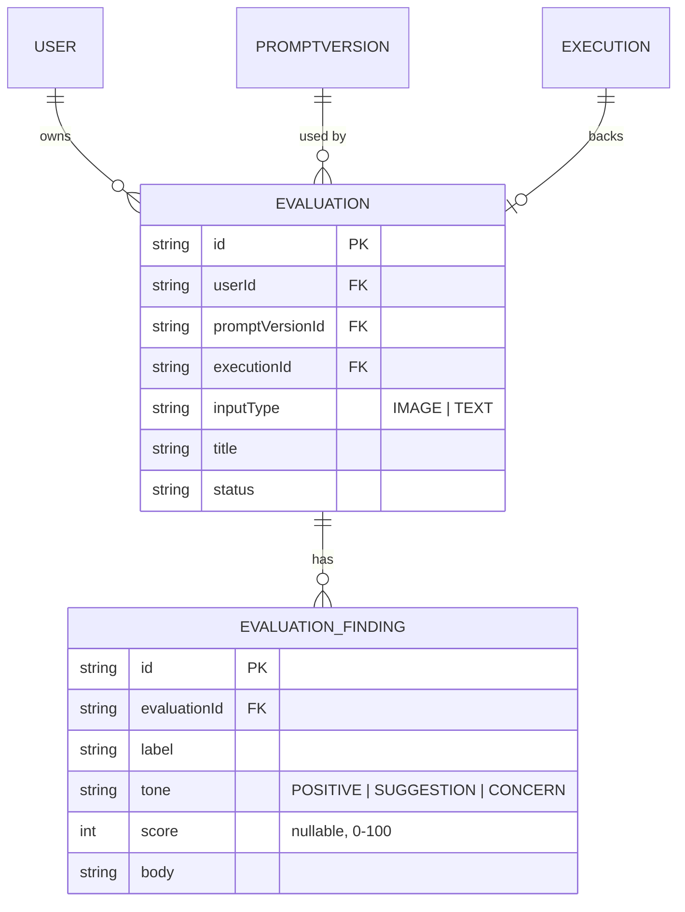
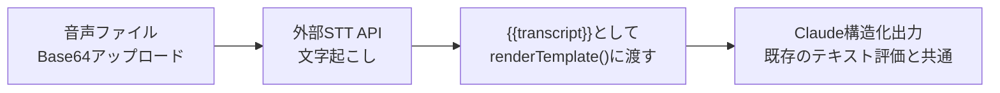

# Phase 5 基本設計書(汎用AI評価ツール)

対象: コードレビューに限定していたAI評価機能を、画像・テキストなど他の入力形式にも対象を広げる。アーキテクチャ・認証は [`phase1-design.md`](./phase1-design.md) を、DB設計の全体像は [`db-design.md`](../db-design.md) を参照。**画像評価(`inputType: IMAGE`)・テキスト評価(`inputType: TEXT`)・PDF評価(`inputType: PDF`)・バックグラウンド処理・共有リンク・通知センター・プロンプトテンプレート集・評価結果の暗号化を実装済み。画像の永続化は個人情報リスクを理由に見送り(下記「見送った拡張候補」参照)。**

## 概要

Phase 2(AIコードレビュー)は、実質的には「Prompt(バージョン管理)→Execution(実行)→構造化出力での指摘」という汎用的な仕組みの上に、GitHubのPR diffという1つの入力形式だけを乗せたものだった。この仕組み自体はコードに限定される理由が無いため、料理の写真・自作の絵・文章など、他の入力形式にも対象を広げる。

- ユーザーが画像またはテキストをアップロード/入力する
- 評価用のプロンプト(Phase 1の`Prompt`資産を再利用)を選ぶ
- Claudeが構造化出力で評価コメントを返す(コメントごとにラベル・トーン・本文)
- 結果は保存され、一覧・詳細で確認できる

## スコープの決定: Reviewとは分離する

Phase 2の`Review`/`ReviewComment`はPRの`filePath`/`line`など、コード固有のフィールドを持ち、「レビュー履歴・傾向」ダッシュボードやRAGチャットの出典表示など既に深く統合されている。ここを無理に汎用化して壊すリスクを避けるため、**`Review`はコードレビュー専用のまま残し、新しく`Evaluation`という並行した概念を追加する**方針にする。

- 将来的に「コードレビューも`Evaluation`の一種(`inputType: GITHUB_PR`)」として統合する余地は残すが、Phase 5では扱わない
- 呼び出すAI・プロンプトの仕組み(`runAiExecution()`、`Execution`)はそのまま共用する

## 対応する入力形式

| 入力形式 | 実現方式 | 備考 |
| --- | --- | --- |
| 画像(`IMAGE`) | Claude Vision(Messages APIの画像入力)にBase64で直接渡す | 料理の写真、自作の絵など |
| テキスト(`TEXT`) | 既存のプロンプト実行と同じ`{{変数名}}`展開 | 歌詞・楽譜のテキスト化した楽曲、文章など |
| PDF(`PDF`、実装済み) | Messages APIのドキュメント入力(`type: "document"`、Base64のPDFソース)にBase64で直接渡す | 履歴書・契約書・論文など |

**音声について**: Claude APIは音声そのものを解析できない(2026-08時点)。「自作の曲を評価してほしい」という要望には、楽曲そのものではなく歌詞・楽譜・曲の説明文をテキストとして入力する形で対応する。音源そのものの分析(リズム・音程等)を行いたい場合は別サービスとの連携が必要になり、Phase 5のスコープ外とする。

## 画像の扱い: 保存しない方針

画像アップロード機能を作ると「アップロードされた画像をどこに保存するか」という問題が付随する(現状S3等のオブジェクトストレージ連携が無い)。Phase 5の最初のバージョンでは、**画像はDBやストレージに永続化せず、リクエストの中でClaudeに渡すだけにする**(結果のテキストのみ保存)。理由:

- ストレージ連携(Vercel Blob等)を新たに増やすと、環境変数・料金・本番デプロイでの動作確認がもう1セット必要になり、Phase 5のスコープが一気に膨らむ
- 評価結果(テキスト)さえ残っていれば、機能としての価値(「AIに評価してもらう」)は成立する
- 「アップロードした写真を結果画面に並べて表示したい」という要望が実際に出てきた時点で、Vercel Blob導入を再検討する(`今後の拡張候補`に記載)

## DB設計(案)



- **`Evaluation`** — 1回の評価実行。`Review`と同じく`promptVersionId`(Restrict。評価に使ったプロンプトは辿れるようにする)・`executionId`(SetNull。実行ログの扱いはReviewと揃える)を持つ。`title`はユーザーが付ける任意のラベル(例:「今日の夕食」)。`inputType`で画像/テキストを区別する
- **`EvaluationFinding`** — `ReviewComment`の`severity`/`filePath`/`line`をコード非依存な形に置き換えたもの。`label`は自由記述の観点名(例:「彩り」「栄養バランス」「構図」)、`tone`はPOSITIVE/SUGGESTION/CONCERNの3値(`ReviewCommentSeverity`のINFO/WARNING/CRITICALと語彙は違うが構造は同じ)、`score`は任意の0-100スコア(評価用途によっては使わなくてもよい)

## 構造化出力スキーマ(案)

```ts
const EvaluationFindingSchema = z.object({
  label: z.string(),
  tone: z.enum(["POSITIVE", "SUGGESTION", "CONCERN"]),
  score: z.number().int().min(0).max(100).nullable(),
  body: z.string(),
});

const EvaluationOutputSchema = z.object({
  summary: z.string(),
  findings: z.array(EvaluationFindingSchema),
});
```

`ReviewOutputSchema`(`src/lib/review-schema.ts`)とほぼ同じ形にすることで、`runAiExecution()`を経由した構造化出力の扱い方をそのまま流用できる。`summary`はコードレビューには無かったフィールドで、写真・文章評価では「総評」を一言添えたいユースケースが多いため追加する。

## 画面構成

| パス | 画面 |
| --- | --- |
| `/evaluations` | 評価一覧・新規作成(画像アップロード or テキスト入力+プロンプト選択) |
| `/evaluations/:id` | 評価結果詳細(総評+観点別コメント) |

## API設計(案)

| メソッド・パス | 内容 |
| --- | --- |
| `POST /api/evaluations` | 画像(Base64)またはテキスト+`promptId`を受け取り、Claudeで評価を実行して`Evaluation`/`EvaluationFinding`を作成 |
| `GET /api/evaluations` | 一覧取得(`LIST_LIMIT`で上限) |
| `GET /api/evaluations/:id` | 詳細取得 |
| `DELETE /api/evaluations/:id` | 削除 |

画像評価はClaude Vision呼び出しがコードレビューより時間がかかるため、`POST /api/evaluations`はバックグラウンド処理(後述)で実行する。まず`PENDING`な`Evaluation`を作って`202 Accepted`ですぐ返し、実際のAI呼び出し・結果の書き込みは応答後に続行する。

## レート制限

既存の`src/lib/rate-limit.ts`のパターン(ユーザー×用途の1時間あたり上限)を`purpose: "evaluation"`として追加する。画像はテキストよりトークン消費が大きいため、実行系(`checkExecutionRateLimit`)とは別カウンタにする。

## 実装方針(段階的ロールアウト)

1. まず画像評価のみをプロトタイプ実装する(テキスト評価は既存の`{{変数名}}`実行とほぼ同じなので後回しでよい)
2. `EvaluationOutputSchema`が実際の用途(料理・絵など)でうまく機能するか、手動でいくつか試して検証してから`/evaluations`画面を作り込む
3. 汎用化の手応えが良ければ、プロンプトテンプレート集(今後の拡張候補)を用意して他の用途を試しやすくする

## テキスト評価(実装済み)

設計どおり、既存のプロンプト実行(`execute-tab.tsx`)と同じ`{{変数名}}`展開を再利用した。`POST /api/evaluations`に`inputType: "TEXT"`を指定すると、画像の代わりに`variables`(`Record<string, string>`)を受け取り、`renderTemplate()`(`src/lib/prompt-variables.ts`)でプロンプト本文に埋め込んだ文字列をそのままClaudeへのメッセージとして渡す(画像評価はcontent配列にimage+textブロックを積むが、テキスト評価は単純な文字列メッセージになる)。バックグラウンド実行・`Evaluation`/`EvaluationFinding`の作成・完了通知の仕組みは画像評価と完全に共通化しており、`inputType`による分岐はメッセージの組み立て部分のみ。

- `/evaluations`のフォームに「画像」/「テキスト」/「PDF」のラジオボタンを追加。テキスト選択時は、選んだプロンプトの本文から`{{変数名}}`を検出し(`extractVariableNames()`)、変数ごとに`<textarea>`を表示する(歌詞・楽譜のテキスト化・文章など、内容が長くなりうるため`<input>`ではなく`<textarea>`にした)。選んだプロンプトに変数が1つも無い場合は、その旨を表示して送信せず気づけるようにする
- 一覧・詳細画面に入力形式(画像/テキスト/PDF)を表示するようにした(`src/lib/evaluation-input-type.ts`のラベルを共通利用)

## PDF評価(実装済み)

画像評価と同じ「ファイルをBase64にしてClaudeへのメッセージに積む」パターンを踏襲し、`content`配列の要素を`image`ブロックから`document`ブロック(`{ type: "document", source: { type: "base64", media_type: "application/pdf", data } }`)に差し替えるだけで実現した。`Evaluation`/`EvaluationFinding`の作成・バックグラウンド実行・通知の仕組みは画像評価と完全に共通。

- `POST /api/evaluations`に`inputType: "PDF"`・`pdfBase64`を渡す。Anthropicのドキュメント入力の上限(32MB/100ページ)より小さい20MBをアプリ側の上限にした(画像の5MBと同じ考え方で、リクエストサイズ・レート制限あたりのコストを抑えるため)
- 画像は保存しない方針(前述)をPDFにも適用し、リクエスト内でClaudeに渡すのみでDB/ストレージには永続化しない
- 履歴書・契約書・論文などレビュー用途を想定。契約書のように専門的な判断が必要な内容は法的助言ではなく読み解きの補助である旨を、テンプレート本文・ヘルプページの両方に明記した

## バックグラウンド処理(実装済み)

`POST /api/evaluations`はバリデーション・レート制限チェックまで済ませた時点で`Evaluation`を`status: PENDING`で作成し、`{ id, status: "PENDING" }`を`202 Accepted`で即座に返す。実際のClaude Vision呼び出し・`Evaluation`/`EvaluationFinding`の書き込みは、Next.jsの[`after()`](https://nextjs.org/docs/app/api-reference/functions/after)でレスポンス送出後に継続する(`src/lib/schedule-background.ts`の`scheduleBackground()`)。新規の常駐ワーカー・キューサービスは追加していない。

- **`scheduleBackground()`の設計**: `after()`はNextのリクエストスコープ(AsyncLocalStorage)が無いと例外を投げる。本番のルートハンドラ経由の呼び出しでは問題なくスケジューリングされるが、統合テストがルートハンドラを直接呼び出す場合はこの例外が発生するため、その場合は`task()`の完了を待ってから返すようフォールバックしている。これにより、本番は非同期・テストは同期という自然な切り替えになり、モックの差し替えが不要になっている
- **失敗時のフォールバック**: バックグラウンド処理中に予期しない例外が発生しても`Evaluation`が`PENDING`のまま残り続けないよう、`try/catch`で最終的に`FAILED`へ倒し、`ErrorLog`にも記録する
- **maxDuration**: `after()`のコールバックもルートの実行時間上限(`maxDuration`)内でしか動かないため、`documents/sync`ルートと同様に`60`秒へ引き上げている
- **完了の通知**: `(app)/layout.tsx`に常駐する`PendingEvaluationsProvider`(`src/components/pending-evaluations-context.tsx`)が、生成直後に登録された`PENDING`な`Evaluation`をポーリングし(5秒間隔)、`SUCCESS`/`FAILED`への変化を検知したらトースト通知する。作成した画面を離れても、アプリ内の別画面に遷移していれば通知される(レイアウトに1つだけマウントされ画面遷移をまたいで動き続けるため)。加えて`/evaluations/:id`を開いたまま待っている場合は、`PENDING`中だけ`PendingRefresher`が定期的に`router.refresh()`してその場で結果を反映する

## 共有リンク(実装済み)

`Evaluation`(成功したもののみ)を、ログイン不要で閲覧できる読み取り専用の公開URLで共有できるようにした。同じ仕組みを`Review`(Phase 2)にも適用しており、Phase 5固有の機能ではなく`ReviewComment`・`EvaluationFinding`を持つ2つの結果画面に共通の機能として実装している。

- `Review`/`Evaluation`それぞれに`shareToken`(発行時に`crypto.randomBytes`で生成する高エントロピーな値。IDそのものは使わない)・`sharedAt`を追加(`src/lib/share-token.ts`)。値がnullなら未共有。
- `POST /api/reviews/:id/share`・`POST /api/evaluations/:id/share`でトークンを発行(所有者のみ、対象が`SUCCESS`でない場合は400で拒否)。既に発行済みなら同じトークンを返す冪等な設計にし、共有中に押し直しても既存のリンクが失効しないようにした。
- `DELETE /api/reviews/:id/share`・`DELETE /api/evaluations/:id/share`でトークンをnullに戻し、旧リンクを無効化する(解除後に同じURLで新しいトークンが復活することはない)。
- 公開ページは`(app)`ルートグループの外(`/share/reviews/:token`・`/share/evaluations/:token`)に置き、認証を要求しない。`shareToken`一致のみで対象を取得し(所有者チェックはしない。トークン自体が公開用の鍵)、詳細画面と同じ内容を編集操作なしの読み取り専用で表示する。
- 詳細画面(`/reviews/:id`・`/evaluations/:id`)に共通コンポーネント`src/components/share-control.tsx`を設置。作成前には「リンクを知っている人は誰でも閲覧できる」旨の`ConfirmDialog`を挟む(プライベートリポジトリの内容や個人的な入力内容が意図せず公開されるリスクへの配慮)。解除は非破壊的なため確認なしで実行できる。

## 通知センター(実装済み)

トースト(`ToastProvider`)はその場でアプリを見ている間しか気づけず、4秒で消えるため見逃しやすい。評価の完了に気づける手段をトースト以外にも用意するため、`Notification`モデルと、ヘッダーに常駐する通知センター(ベルアイコン)を追加した。

- `Notification`(`userId`・`message`・`link`・`read`)を追加。AI評価のバックグラウンド処理(`POST /api/evaluations`の`scheduleBackground`コールバック)が、SUCCESS/FAILEDいずれの完了時にもサーバー側で1件作成する(`src/lib/notifications.ts`の`createEvaluationNotification`)。通知作成自体はEvaluationの確定より重要度が低い副次処理のため、`ReviewComment`の埋め込み生成と同じベストエフォート方針(失敗してもEvaluationのステータス確定には影響させず、`ErrorLog`にのみ記録)にした
- `GET /api/notifications`(直近20件+未読件数)・`PATCH /api/notifications/:id`(既読化)・`POST /api/notifications/read-all`(一括既読化)を追加
- `src/components/notification-center.tsx`をヘッダーに常駐させ、20秒間隔でポーリングして未読件数をバッジ表示する。`PendingEvaluationsProvider`(トースト用)とは独立して動作するため、他のタブ・別セッションで作成した評価が完了した場合も拾える
- クライアント側の作成直後の監視状態(`registerPending`)には依存せず、サーバー側で確定した`Notification`だけを見るシンプルな設計にした(トースト用の仕組みを拡張するのではなく、別の恒久的な仕組みとして並存させている)

## プロンプトテンプレート集(実装済み)

Phase 5(AI評価)を試しやすくするための叩き台プロンプトを用意した。専用のDBモデル・APIは追加せず、`src/lib/prompt-templates.ts`に静的なリストとして持たせるだけのシンプルな仕組みにした。IMAGE/TEXT/PDFそれぞれ2〜4種、計10種(料理写真・イラスト・部屋の写真・筋肉、歌詞・文章・ビジネスメール、履歴書・契約書・論文)を用意している。

- `/prompts/new`(`new-prompt-form.tsx`)に「テンプレートから始める」を追加。入力形式(画像用/テキスト用/PDF用)ごとにグループ化して表示し、選ぶとタイトル・本文欄がテンプレートの内容で置き換わる(既存の入力は上書きされる)。そのまま保存することも自由に書き換えることもできる
- テンプレートは通常のプロンプト作成フローに乗るだけで、`Prompt`/`PromptVersion`の扱いは既存のものと変わらない(テンプレート自体を追跡する仕組みは持たない)
- 入力形式のラベル(画像/テキスト/PDF)は`src/lib/evaluation-input-type.ts`に集約し、`/evaluations`のフォーム・一覧・詳細画面・共有ページ・テンプレート一覧の間で表記が揺れないようにした

## 評価結果の暗号化(実装済み)

履歴書・契約書などPDF評価の対象が広がったことで、評価結果のテキストに個人情報が含まれうるようになった。ユーザーから「DBにも残したくない」と相談を受け、GitHubトークンで既に使っている仕組み(`src/lib/token-crypto.ts`、AES-256-GCM)を再利用してAI評価結果を暗号化して保存する対応を行った(完全に保存しない、という選択肢も検討したが、`/evaluations`一覧・詳細で過去の結果を見返す機能自体が成立しなくなるため見送った)。

- `src/lib/field-crypto.ts`で`token-crypto.ts`のAES-256-GCM実装を`encryptField`/`decryptField`として再エクスポートし、評価結果側からは用途に合った名前で使えるようにした。判別プレフィックス(`isEncryptedToken`)による後方互換の挙動もそのまま引き継ぐため、この対応より前に作成された`EvaluationFinding.body`(平文)も復号時にそのまま読める
- `Evaluation`に`summary`列(暗号化して保存)を新設した。以前は総評を`Execution.resultText`(構造化出力全体のJSON)から都度再構築していたが、この列を追加後は不要になった。`summary`が無い(この対応より前に作成された)評価のみ、従来どおり`Execution.resultText`からの再構築にフォールバックする(`src/lib/evaluation-summary.ts`)
- **`Execution.resultText`には実際の内容を書かない**: `Execution`はプロンプト実行・AIレビュー・AI評価で共有される1つのテーブルであり、AI評価の総評・コメントをそのまま`resultText`に平文で複製すると、暗号化が及ばないその共有列経由で(実行履歴タブ・実行結果比較・RAG埋め込みバックフィルなど、AI評価を想定していない箇所から)個人情報が読めてしまう。そのためAI評価の`resultText`は固定のプレースホルダー文字列に置き換え、実際の内容は暗号化された`Evaluation.summary`/`EvaluationFinding.body`にのみ持たせるようにした
- 上記に伴い、`POST /api/executions/backfill-embeddings`・`/documents`の未処理件数カウントから、AI評価由来(`evaluation`が紐づく)の`Execution`を対象外にした(プレースホルダー文字列を埋め込んでもRAG検索の役に立たないため)

**共有リンク作成時の個人情報アラートは見送り**: 内容を自動判定して警告を出す案(Claudeに評価結果を判定させる)も検討したが、誤検知・見逃しのリスクがあり、既存の汎用的な確認ダイアログ(`ShareControl`)で十分と判断した。

## 音声評価(案、文字起こしベース、未着手)

Claude API(Messages API)は2026-08時点でも音声を直接扱えるcontent block(画像の`image`・PDFの`document`に相当するもの)を持たない。そのため音声そのものではなく、**外部の音声認識(Speech-to-Text)サービスで文字起こしした結果をClaudeに渡す**方式で対応する。ユーザーと相談のうえ、まず「話している内容・歌詞など言葉の中身」の評価から着手し、「音程・リズム・演奏の上手さ」といった音響的な評価は運用実績を見てから別途検討する2段階アプローチとする(2026-08-27)。

### 対応方式

1. ユーザーが音声ファイル(`inputType: "AUDIO"`)をアップロードする(画像・PDFと同じくBase64でAPIに渡す)
2. サーバー側で外部STT APIを呼び出し、文字起こしテキストを取得する(`src/lib/transcription.ts`(新設)が担当。`src/lib/anthropic.ts`・`voyage`クライアントと同じく専用ラッパーにする)
3. 文字起こし結果を`transcript`という固定名の変数として扱い、既存のテキスト評価(`renderTemplate()`、`{{transcript}}`)にそのまま渡す。ユーザーが用意する音声評価用プロンプトは本文に`{{transcript}}`を含める(プロンプトテンプレート集に音声用テンプレートを追加し、書き方を示す)
4. 以降(構造化出力・`Evaluation`/`EvaluationFinding`作成・バックグラウンド実行・通知)は既存のテキスト評価と完全に共通



### STTサービスの選定(検討中)

Voyage AI(埋め込み専用)と同じ考え方で、生成AIではなく単機能の専用サービスとして別途契約する。候補は以下。ユーザーと相談のうえ決定する。

| 候補 | 備考 |
| --- | --- |
| OpenAI Whisper API | 実績・精度十分、料金体系がシンプル。ファイルサイズ上限25MB程度(要確認)という制約があり、アプリ側の上限設計に直結する |
| Google Cloud Speech-to-Text | 長時間音声・話者分離等の機能が豊富だが、GCPプロジェクトの追加セットアップが必要 |
| Deepgram / AssemblyAI | 音声特化のSaaS。日本語精度・料金を個別に検証する必要がある |

### DB設計(案)

- `EvaluationInputType`に`AUDIO`を追加
- `Evaluation`に`transcript`列(nullable、`summary`と同じく`encryptField`で暗号化)を追加する。文字起こし結果自体をユーザーが見返して精度を確認できるようにするため、評価コメントとは別に保持する

### 画像・PDFと同じく「音声ファイル自体は保存しない」

画像・PDFの方針(前述)をそのまま踏襲する。音声(特に本人の声)は画像以上に個人を特定しうる生体情報であるため、アップロードされた音声データはSTT呼び出しのリクエスト内で使うのみでDB/ストレージには一切永続化しない。永続化するのは文字起こし結果(暗号化済み)と評価結果のみ。

### 制約・検討事項(未整理)

- STTサービスの最終選定(前述)、日本語音声での精度検証
- ファイルサイズ上限(STTサービス側の上限に合わせてアプリ側の上限を決める。画像5MB・PDF20MBと同様の考え方)
- 音声の長さ上限(STT側の処理時間・料金に直結するため、時間ベースの上限も別途検討)
- レート制限(`purpose: "evaluation"`を流用するか、STT呼び出しコストを踏まえ専用カウンタにするか)
- `docs/requirements-definition.md`の制約C-1(「音声入力への対応は行わない」)は本対応の実装時に見直しが必要

## 音響解析による評価(将来候補、未着手・要技術調査)

歌唱力・楽器演奏・話し方(声のトーン等)そのものを評価したいという要望には、文字起こしだけでは対応できない(言葉の中身ではなく音そのものの特徴が必要)。ピッチ・テンポ・リズムなどを数値的な特徴量として抽出し、その特徴量をテキスト化してClaudeに渡す(または特徴量そのものをスコアとして提示する)方式が必要になる。

- 文字起こしのように成熟した汎用SaaSが定まっておらず、用途(歌唱評価/演奏評価/話し方評価)ごとに適した音響解析ライブラリ・サービスの調査が別途必要(technical spike)
- 文字起こしベースの音声評価(前述)の運用実績・利用状況を見たうえで、着手するか改めて判断する


- **画像の永続化**: Vercel Blob等を導入し、アップロードした画像を結果画面に表示できるようにする案。筋肉の写真や履歴書のスキャン画像など、評価対象そのものに個人情報が写り得るようになったため、評価結果の暗号化(前述)と同水準の対策(画像自体の暗号化・共有リンクからの除外等)を別途講じる必要があり、得られる価値(結果画面で元の画像を見返せる)に見合わないと判断し、ユーザーと相談のうえ見送った(2026-08-26)
