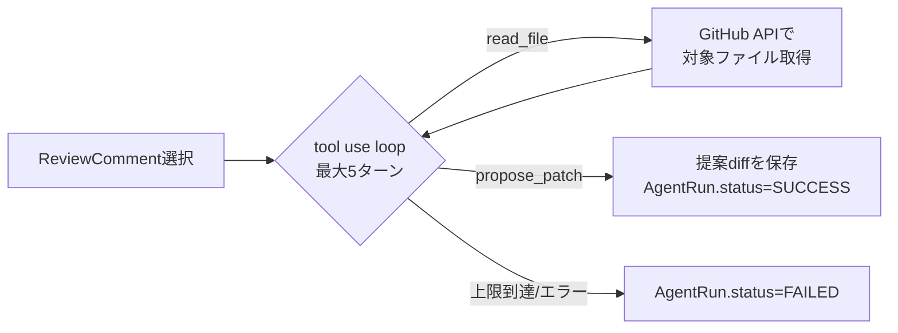
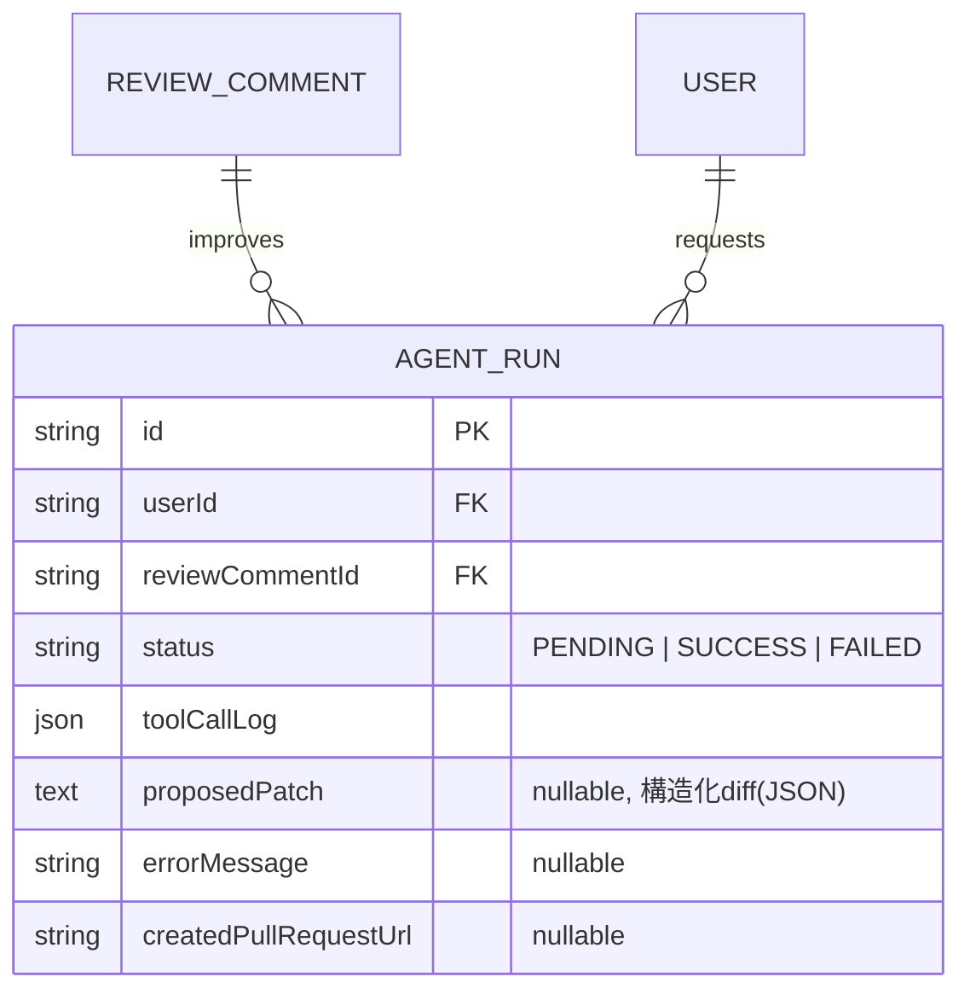

# Phase 6 基本設計書(エージェント型AI機能)

対象: Claudeの呼び出しを「1回のプロンプト→1回の構造化出力」で完結させてきた既存の実行基盤(`runAiExecution()`)を拡張し、複数ステップのtool useを伴う自律的なアクション(コードを読む→修正案を作る)に対応させる。**未着手・設計フェーズ**。アーキテクチャ・認証は [`phase1-design.md`](./phase1-design.md) を、DB設計の全体像は [`db-design.md`](../db-design.md) を参照。

## 概要

Phase 2(AIコードレビュー)・Phase 5(汎用AI評価)は、いずれも「入力を渡す→Claudeが構造化出力で指摘/評価コメントを返す→人間が読む」で完結する分析専用の機能である。Phase 6では、AIレビューで指摘された内容に対して**Claude自身がリポジトリのファイルを読み、修正diffを提案する**ところまで踏み込む。ただし、提案の**自動適用は行わない**(人間が確認してPRを作成するボタンを押すまでは何も変更されない)。

- レビュー画面(`/reviews/:id`)の指摘から「AIに修正案を作らせる」を実行する
- Claudeが対象ファイルを読み(tool use)、必要なら関連ファイルも追加で読み、修正diffを提案する
- 提案されたdiffは画面に表示するのみで、ユーザーが確認して初めてブランチ作成・PR作成が実行される

## スコープの決定: まずAIレビューの修正提案に限定する

Phase 5がコードレビューとは別に`Evaluation`を新設したのと同じ考え方で、Phase 6も対象を絞る。汎用的な「AIエージェント基盤」を最初から作ると、対象ドメインごとに異なるツール定義・安全設計が必要になりスコープが際限なく膨らむため、**最初の実装対象はAIレビュー(`Review`/`ReviewComment`)の修正提案のみ**とする。

- 対象リポジトリの中身を読める(GitHub連携済み)・PRとして変更を出せる(Octokit連携済み)という基盤が既にあるコードレビューが、最小の追加コストで価値を出せる領域
- AI評価(`Evaluation`)側への展開(例: 契約書PDFの修正案)は、コードレビューでの運用実績を見てから改めて検討する(本Phaseのスコープ外)
- コード実行(テスト・lintの実行)を伴う修正検証は行わない(下記「見送る候補」参照)。あくまで「diffを提案する」までがゴール

## アーキテクチャ: 単発呼び出しとの違い

既存の`runAiExecution()`(`src/lib/run-ai-execution.ts`)は「`call()`を1回実行してExecutionを記録する」という単純な形をしている。tool useのループ(Claudeがtoolを呼ぶ→アプリ側でtoolを実行して結果を返す→Claudeが次の応答を返す、を繰り返す)はこの形に収まらないため、並行する別の実行基盤`runAgentExecution()`を`src/lib/run-agent-execution.ts`に新設する。

- `Execution`テーブルは1回のAI呼び出し単位のレコードという前提(`promptTokens`/`completionTokens`が単発呼び出し用)のため、複数ターンにまたがるエージェント実行をそのまま記録する器としては使わない。ターンごとの入出力・tool呼び出しログは新設の`AgentRun`にまとめて持たせる
- 呼び出しは`anthropic.messages.create`(構造化出力用の`.parse`ヘルパーではなく、tool useのため生のMessages APIを使う)。最終応答として`propose_patch`ツールが呼ばれた場合のみ成功とみなし、テキスト応答だけで終わった場合(=ツールを使わず自然文で終えた場合)は失敗として扱う

## ツール定義(v1、最小構成)

安全のため、v1で提供するツールは読み取り専用+提案の2つだけに絞る。

| ツール名 | 内容 | 安全上の制約 |
| --- | --- | --- |
| `read_file` | 対象レビューが属するリポジトリの指定パスのファイル内容を取得する(既存のOctokit連携を利用) | 対象は当該レビューの`repositoryId`に紐づくリポジトリのみに固定し、引数でリポジトリを跨げないようにする。1ファイルあたりの取得サイズに上限を設ける |
| `propose_patch` | 修正内容を`{ files: [{ path, diff }], summary }`の構造化データとして返す、ループを終了させる終端ツール | サーバー側では保存するだけで、Gitへの書き込み・PR作成は一切行わない |

- 任意のシェルコマンド実行・ファイル書き込みツールはv1では提供しない
- ツール名はホワイトリスト固定(Claudeが提案する未知のtool名は無視してエラー扱いにする)
- ループの最大ターン数(例: 5)・1リクエストあたりの`max_tokens`上限をコードで固定し、暴走(無限にread_fileを呼び続ける等)によるコスト増を防ぐ

## DB設計(案)

- **`AgentRun`** — 1回のエージェント実行。どの指摘(`ReviewComment`)に対する修正提案かを紐付ける(`onDelete: Cascade`)。`toolCallLog`はツール名・引数・結果を時系列で記録したJSON配列で、監査・デバッグ用(何を読んで何を提案したかを後から追える)
- `proposedPatch`は提案されたdiffそのもの(ファイルパス+diff文字列の配列)。PR化されるまでは保存されているだけの提案でしかない
- `createdPullRequestUrl`は、ユーザーが提案を承認してPR作成を実行した場合にのみ埋まる(nullのままなら「提案止まり」)

## 画面構成

| パス/箇所 | 内容 |
| --- | --- |
| `/reviews/:id`(既存画面の拡張) | 各`ReviewComment`に「AIに修正案を作らせる」ボタンを追加 |
| 同画面内のパネル(モーダル or インライン展開) | `AgentRun`の進行状況(PENDING中はtool呼び出しのステップ表示)・完了後は提案diffのプレビュー(ファイルごとのdiff表示)・「PRを作成」ボタン |

## API設計(案)

| メソッド・パス | 内容 |
| --- | --- |
| `POST /api/review-comments/:id/agent-runs` | 指摘に対する修正提案の実行を開始(バックグラウンド処理、`202 Accepted`) |
| `GET /api/agent-runs/:id` | 実行状況・提案内容の取得(ポーリング用) |
| `POST /api/agent-runs/:id/create-pull-request` | 提案diffをもとに新規ブランチ+PRを作成(既存のOctokit連携を利用。所有者の明示的な操作でのみ実行される) |

- 実行は既存のAI評価(Phase 5)と同様に`scheduleBackground()`でバックグラウンド実行し、`PendingEvaluationsProvider`と同じポーリング+トースト通知のパターンを流用する
- レート制限は`src/lib/rate-limit.ts`に`purpose: "agent"`を新設する。tool useは複数ターン分のトークンを消費し単発呼び出しより高コストなため、既存の`execution`(1時間20回)より低い上限(例: 1時間5回)にする

## 実装方針(段階的ロールアウト)

1. `runAgentExecution()`と`read_file`/`propose_patch`ツールのみをまず実装し、`AgentRun`をAPI経由で作成できるところまでをプロトタイプとする(UIはまだ最小限でよい)
2. 実際にいくつかのレビュー指摘で試し、提案diffの精度・tool呼び出し回数(コスト)を検証してから`/reviews/:id`のUIを作り込む
3. 手応えが良ければ「PRを作成」までを実装し、実際にGitHub上でPRが立つところまで通す

## 今後の検討事項(未整理)

- ターン数・tokenあたりのコスト実績を見たうえでのレート制限の上限調整
- 提案diffが実際のコードベースと衝突する(対象ファイルがレビュー後に変更されている)場合の扱い
- `AgentRun`の`toolCallLog`をエラーログ画面(`/errors`)や利用状況ダッシュボードとどう関連付けるか

## 見送る候補(v1)

- **コード実行ツール(テスト・lintの実行)**: 修正案が実際にテストを通るかまで検証できれば価値が上がるが、任意コード実行のサンドボックス環境(コンテナ分離・タイムアウト・ネットワーク遮断)を新たに用意する必要があり、v1のスコープには入れない
- **修正の自動適用・自動マージ**: 人間の承認なしにコードへ変更を反映することは行わない。既存のPhase 2・5が一貫して「AIは指摘・提案まで、判断は人間」という方針を取っているのと揃える
- **AI評価(`Evaluation`)への展開**: コードレビューでの運用実績を踏まえて別Phaseとして再検討する
