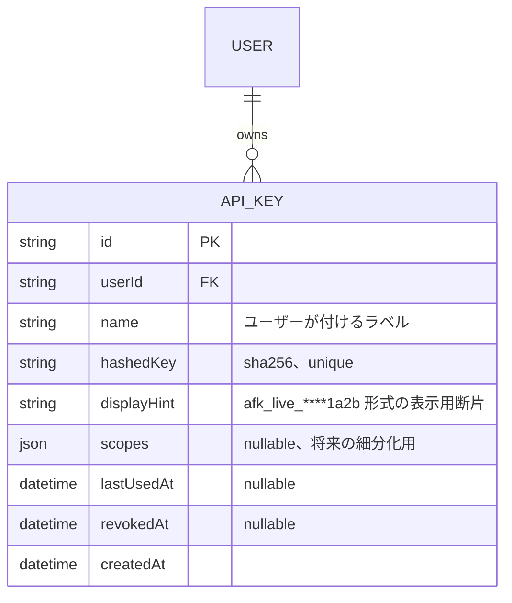

# Phase 7 基本設計書(公開API・APIキー発行基盤)

対象: これまでセッション認証(GitHub OAuth)経由のブラウザ操作のみを前提としてきたAPIを、外部のCI/スクリプト/cronから呼び出せるようスコープ付きAPIキー認証に対応させる。**未着手・設計フェーズ**。アーキテクチャ・認証は [`phase1-design.md`](./phase1-design.md) を参照。

## 概要

現状、ai-forgeのAPI(`src/app/api/`配下)は`auth()`によるセッション確認のみを前提としており、ブラウザでログインしていない外部プロセス(GitHub Actions、cron、他ツールからのスクリプト)から呼び出す手段がない。Issue #106(GitHub Webhookによるレビュー自動実行)・#111(定期実行レビュー)はいずれも「外部のトリガーからai-forgeの機能を呼び出したい」という要求であり、機能ごとに個別のWebhook/cron実装をアプリ内に増やすより、**汎用的なAPIキー認証を1つ用意し、その上に#106・#111を外部呼び出しとして構築する**方が筋が良い。

- ユーザーがAPIキーを発行し、`Authorization: Bearer <key>`ヘッダーで外部からAPIを呼べるようにする
- 既存のセッション認証と共存させる(ブラウザからの操作は今まで通りセッション認証のまま)
- 既存のレート制限(`RateLimitBucket`)をそのまま再利用し、APIキー経由でも同じ上限を適用する

## 認証方式の設計

### キーの発行・保管

GitHub Personal Access Token・Stripeのシークレットキーと同じ考え方を採用する。

- キー本体は`afk_live_`のようなプレフィックス+高エントロピーなランダム文字列(`crypto.randomBytes`)。**平文は発行時に一度だけ画面に表示し、DBには保存しない**
- DBには`sha256`でハッシュ化した値のみを保存し、認証時は受け取ったキーを同じ方式でハッシュ化して一致するレコードを検索する(パスワードのハッシュ保存と同じ考え方。`token-crypto.ts`のAES暗号化は復号が必要な用途向けであり、APIキーは復号不要なため単純な一方向ハッシュで十分かつより安全)
- 一覧表示用に、プレフィックス+末尾4桁程度の識別用断片のみ平文でDBに残す(GitHub等のUIで見慣れた「`afk_live_••••••••1a2b`」のような表示を実現するため)

### 認可・スコープ

- v1では細粒度のパーミッションは持たせず、**キー1本＝そのユーザー自身としてAPIを呼べる**というシンプルな設計にする(既存の`userId`所有権チェックがそのまま使える)
- 用途の限定(例: 「このキーはレビュー実行専用」)は`scopes: string[]`カラムを持たせておき、v1では「未指定=全用途」のみをサポート。将来のスコープ細分化に備えて型だけ用意しておく

### 既存ルートへの組み込み

`src/lib/session.ts`の`requireUserId()`と並行する形で、APIキー・セッションいずれでも認証できる`resolveUserId(request)`を新設する。

```ts
// イメージ
async function resolveUserId(request: Request): Promise<string | null> {
  const authHeader = request.headers.get("authorization");
  if (authHeader?.startsWith("Bearer ")) {
    return resolveApiKeyUserId(authHeader.slice(7));
  }
  const session = await auth();
  return session?.user?.id ?? null;
}
```

- 外部呼び出しの対象になり得るルート(`POST /api/repositories/:id/reviews`、`POST /api/evaluations`など)から順に、既存の`auth()`直呼びを`resolveUserId()`に置き換える
- 画面遷移前提のルート(セッションCookie必須のもの、GitHub OAuthコールバック等)はセッション認証のみのまま変更しない

## DB設計(案)



- `revokedAt`による論理削除にする(共有リンクの`shareToken`解除と同じ考え方)。物理削除にすると、そのキーによる過去の呼び出し(`RateLimitBucket`等)との対応関係が追いにくくなるため
- `lastUsedAt`は認証成功のたびに更新し、キー管理画面で「最終利用日時」を表示して不要なキーの棚卸しをしやすくする

## レート制限

既存の`checkRateLimit(userId, purpose, limit)`の枠組みをそのまま使う。**APIキー経由かセッション経由かでカウンタを分けない**(同一ユーザーの利用量として一元管理する)ことで、「UIでは制限に達したのでスクリプトで回避する」という抜け道を防ぐ。

## 画面構成

| パス | 内容 |
| --- | --- |
| `/settings/api-keys`(新設) | 発行済みキーの一覧(名前・表示用断片・最終利用日時・失効ボタン)、新規発行フォーム |

- 新規発行直後のみ、生成された平文キーをコピー可能なダイアログで一度だけ表示する(閉じたら二度と表示できない旨を明記)。既存の`ConfirmDialog`パターンを流用する

## API設計(案)

| メソッド・パス | 内容 |
| --- | --- |
| `GET /api/api-keys` | 発行済みキー一覧取得(セッション認証のみ。キー自体ではキー管理APIは呼べない) |
| `POST /api/api-keys` | 新規発行(`name`を受け取り、平文キーを一度だけレスポンスに含めて返す) |
| `DELETE /api/api-keys/:id` | 失効(`revokedAt`を設定) |

## セキュリティ上の考慮

- 平文キーはレスポンスボディ以外(ログ・ErrorLog等)に一切出力しない。`logError()`に渡すメッセージにAuthorizationヘッダーの値を含めないよう、既存の呼び出し箇所を確認する
- キー管理API自体(`/api/api-keys`)はAPIキーでは呼べない(セッション認証必須)ことで、漏洩したキー1本から新しいキーを量産される事態を防ぐ
- 失効したキーの`hashedKey`は照合対象から外れるが、レコード自体は監査目的で残す(前述)

## 実装方針(段階的ロールアウト)

1. `ApiKey`モデル・発行/失効API・`resolveUserId()`をまず実装し、`POST /api/evaluations`など1エンドポイントだけで動作確認する
2. `/settings/api-keys`画面を実装する
3. 対象ルートを順次`resolveUserId()`に置き換える
4. Issue #106(GitHub Webhookによる自動レビュー)・#111(定期実行レビュー)を、このAPIキーを使った外部トリガー(GitHub Actions・外部cron)として実装する(ai-forge自身に新しい常駐ジョブ基盤を持たせない、既存のバックグラウンド実行の枠組みで完結させる)

## 今後の検討事項(未整理)

- スコープ細分化(読み取り専用キー等)を実際に必要とする場面が出てきたときの設計
- APIキー経由の呼び出しを`ErrorLog`・利用状況ダッシュボードでセッション経由と区別して表示するか
