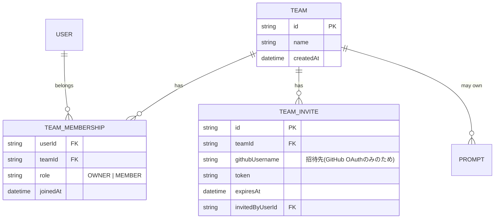

# Phase 8 基本設計書(マルチユーザー/チーム機能)

対象: シングルテナント前提(`docs/requirements-definition.md`のスコープ外事項C-3「複数人での共同編集・権限管理は対象外」)だった認可モデルを拡張し、複数人でプロンプト・リポジトリ・評価結果を共有できるチーム機能を追加する。**未着手・設計フェーズ。3案の中で最も影響範囲が大きく、着手前に方針決定が必要**。アーキテクチャ・認証は [`phase1-design.md`](./phase1-design.md) を、DB設計の全体像は [`db-design.md`](../db-design.md) を参照。

## 概要

現行のDBスキーマは、`Prompt`・`Repository`・`Document`・`Evaluation`・`Review`など主要な全リソースが`userId`で単一の所有者に紐づく前提で作られている(`prisma/schema.prisma`確認済み)。Phase 8では、ユーザーが1つ以上の`Team`に所属し、チーム単位でリソースを共有できるようにする。

- ユーザーはチームを作成・招待・参加できる
- リソース(プロンプト等)は「個人所有」か「特定チーム所有」のいずれかになる
- チームメンバーは、チーム所有のリソースを閲覧・編集できる(ロールに応じて)

**リアルタイム共同編集(同じPromptVersionを複数人が同時編集する等)は対象外**とする。ここでのチーム機能は「共有・可視性・権限」の話であり、Google Docsのような同時編集は別問題として切り離す(Phase 5がReviewとEvaluationを分離したのと同じく、スコープを明確に区切る)。

## 最初に決めるべき方針: 所有権モデルの選択

これが本Phase最大の設計判断であり、既存コードへの影響範囲を大きく左右する。実装着手前にユーザーと相談して決定する(現時点では両論併記とし、著者の推奨のみ添える)。

### 案A: `teamId`を既存の`userId`と併存させる(推奨)

各リソーステーブルに**nullableな`teamId`**を追加する。`teamId`が null なら従来通りの個人所有、値が入っていればチーム所有として扱う。

- 利点: 既存の`userId`カラム・`where: { userId }`クエリ・インデックスをそのまま残せる。個人利用しかしないユーザーには何の変更もない。移行(マイグレーション)は「カラム追加のみ」で済み、既存データは全て`teamId: null`(個人所有)のまま矛盾なく解釈できる
- 欠点: 認可チェックが「`userId`一致 **または** `teamId`が所属チームでロールが十分」の分岐になり、リソースの所有権判定ロジックが2系統になる

### 案B: 個人アカウントも「1人チーム」として扱い、常にチーム所有に統一する

個人アカウントも自動生成された「自分専用チーム」に属するとみなし、全リソースは常に`teamId`で所有される(`userId`直接参照は廃止)。

- 利点: 認可ロジックが「チームのメンバーか」の1系統に統一され、長期的にはシンプル
- 欠点: 既存の全リソース・全クエリ(ほぼ全APIルート)を書き換える大規模移行になる。ソロメンテナンスの現状のプロジェクト規模に対してリスク・工数が見合わない

**推奨: 案A**。将来的にチーム利用が主流になった場合に案Bへ寄せる余地は残しつつ、まずは影響範囲を局所化する。

## DB設計(案、案Aベース)



- `TeamMembership`は`@@id([userId, teamId])`の複合主キーとする(`RateLimitBucket`と同じ考え方)
- 対象リソース(`Prompt`・`Repository`・`Document`・`Evaluation`など)には`teamId String?`を追加する。`user`(必須)はそのまま残し、「誰が作ったか」の記録と「誰が所有するか(個人/チーム)」の区別を分離する
- 招待はGitHub OAuthのみを認証手段としているため、メール招待ではなく**GitHubユーザー名指定+専用トークンのURL**で行う。招待の受諾には、受諾者がai-forgeに既にログイン済み(またはこのタイミングでGitHub OAuthを行う)である必要がある

## 認可設計

現状の各APIルートは概ね次のパターンで書かれている(`prompts/[id]/route.ts`等で確認済み):

```ts
const prompt = await prisma.prompt.findFirst({ where: { id, userId } });
if (!prompt) return 404;
```

これを、チーム所有リソースも通す形に拡張する共通ヘルパーを用意する。

```ts
// イメージ: 個人所有 or 所属チーム所有のいずれかで一致すればアクセス可
function ownerFilter(userId: string, teamIds: string[]) {
  return { OR: [{ userId, teamId: null }, { teamId: { in: teamIds } }] };
}
```

- 「見る」権限と「編集・削除する」権限を分け、`MEMBER`ロールは閲覧+実行(プロンプト実行・レビュー実行等)はできるが、リソースの削除・チームからの脱退操作は`OWNER`のみに制限する、といった粒度をどこまで持たせるかは実装時に詰める(v1は「メンバーなら概ね何でもできる」程度の粗い粒度から始め、必要に応じて絞る方が安全側に倒しやすい)
- この変更は**既存の`userId`所有権チェックを行っている全APIルートに機械的だが広範囲な修正が入る**ため、本Phase最大の実装リスクとして認識しておく。1機能ずつ(まずPromptのみ等)段階的に対応し、対応済み/未対応の境界を明確にする

## 画面構成

| パス | 内容 |
| --- | --- |
| `/teams`(新設) | 所属チーム一覧、新規作成 |
| `/teams/:id`(新設) | メンバー一覧・招待・ロール変更・脱退 |
| ヘッダー(既存の拡張) | 「個人」/所属チームを切り替えるチームスイッチャー。選択中のコンテキストによって`/prompts`等の一覧が個人所有分/選択中チーム所有分でフィルタされる |

- チームスイッチャーの選択状態は、Cookie等でセッションに紐づけて保持する(画面遷移のたびに選び直させない)

## API設計(案)

| メソッド・パス | 内容 |
| --- | --- |
| `GET/POST /api/teams` | 所属チーム一覧取得・新規作成(作成者が自動的にOWNERになる) |
| `GET /api/teams/:id` | メンバー一覧取得 |
| `POST /api/teams/:id/invites` | 招待発行(GitHubユーザー名指定) |
| `POST /api/teams/invites/:token/accept` | 招待の受諾 |
| `DELETE /api/teams/:id/members/:userId` | メンバー削除/脱退 |
| 既存の各リソースAPI(`/api/prompts`等) | リクエストに現在選択中のチームコンテキストを反映し、`teamId`を伴う作成・`ownerFilter()`による取得に変更 |

## 今後の検討事項(未整理、着手前に要相談)

- 所有権モデルの最終決定(前述の案A/B)
- チーム所有リソースを個人所有に戻す(またはその逆)移管操作の要否
- レート制限(`RateLimitBucket`)を個人単位のままにするか、チーム単位の合算枠を新設するか
- 共有リンク(Phase 5)・通知センターのチーム対応(チームメンバー全員に通知するか、実行者のみか)
- 既存の`docs/requirements-definition.md`スコープ外事項C-3の見直し(本Phase着手時に改訂)

## 見送る候補

- **リアルタイム共同編集**(前述、スコープ外として明確に区切る)
- **組織外ユーザーとのゲスト共有**(共有リンクの仕組み(Phase 5)で代替可能なため、チーム機能としては扱わない)
